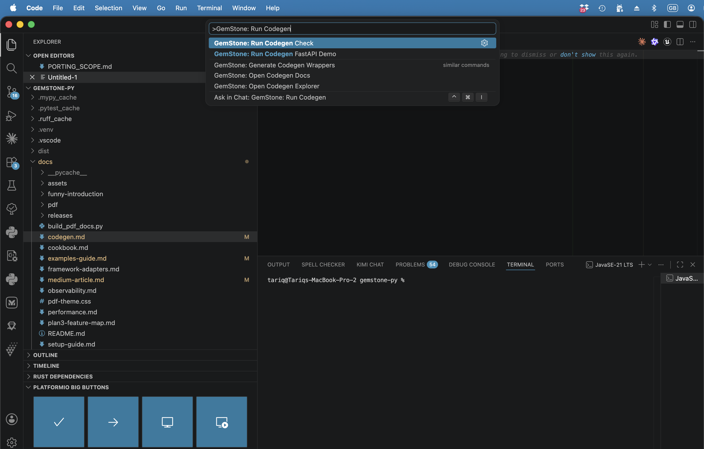
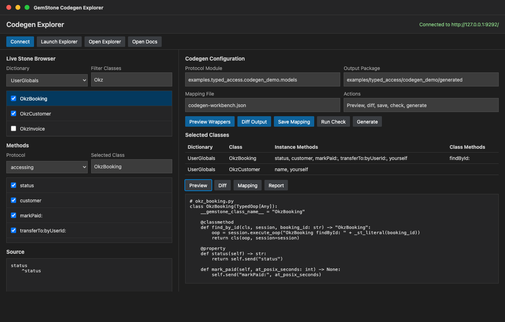

# Type-Safe Smalltalk Codegen

`gemstone-codegen` turns registered Python `Protocol` classes into concrete
`TypedOop` wrappers. The generated files are ordinary Python modules, so IDEs
can autocomplete methods and your application code no longer has to spell the
same Smalltalk strings at every call site.

## Install

The generator ships with `gemstone-py`:

```bash
python -m pip install gemstone-py
gemstone-codegen --help
```

For source checkouts:

```bash
python -m pip install -e ".[examples,dev]"
python -m gemstone_py.codegen --help
```

## Define Protocols

Create a module with one or more `@gemstone_class(...)` protocols:

```python
from typing import Protocol
from gemstone_py import gemstone_class, gemstone_selector

@gemstone_class("OkzBooking", async_=True)
class OkzBookingProto(Protocol):
    status: str

    @classmethod
    @gemstone_selector("findById:")
    def find_by_id(cls, booking_id: str) -> "OkzBookingProto":
        ...

    def mark_paid(self, at_posix_seconds: int) -> None:
        ...

    def yourself(self) -> "OkzBookingProto":
        ...

    def customer(self) -> "OkzCustomerProto":
        ...

    @gemstone_selector("transferTo:byUserId:")
    def transfer(self, user_id: int, by_user_id: int) -> None:
        ...

@gemstone_class("OkzCustomer", async_=True)
class OkzCustomerProto(Protocol):
    name: str
```

`async_=True` asks the generator to emit both sync and async wrappers.

## Generate Wrappers

Run the generator from the repository or application root:

```bash
gemstone-codegen \
  --module examples.typed_access.codegen_demo.models \
  --output examples/typed_access/codegen_demo/generated \
  --clean
```

The output is meant to be checked in. That keeps reviews, editor indexing, and
type checking predictable:

```bash
git add examples/typed_access/codegen_demo/generated
```

The generated package includes `.pyi` stubs and `py.typed` so type checkers
treat the checked-in wrapper package as typed. `--clean` removes stale
generated wrapper modules and stale wrapper stubs when a Protocol is renamed or
deleted.

Each generated wrapper class also exposes lightweight runtime metadata:

```python
print(OkzBooking.__gemstone_protocol__)
print(OkzBooking.__gemstone_selectors__["find_by_id"])
```

Use that metadata for diagnostics, generated-wrapper audits, and UI tooling
without parsing generated source files.

Use package generation for protocols that return other generated protocols.
Single-class `generate_wrapper(...)` only has enough context to resolve
self-typed returns.

Use `--check` in CI or pre-commit hooks to catch drift:

```bash
gemstone-codegen \
  --module examples.typed_access.codegen_demo.models \
  --output examples/typed_access/codegen_demo/generated \
  --check
```

The repository CI runs the same check through:

```bash
./scripts/check_codegen.sh
```

If your application uses `pre-commit`, it can consume the packaged hook:

```yaml
repos:
  - repo: https://github.com/unicompute/gemstone-py
    rev: main
    hooks:
      - id: gemstone-codegen-check
```

## Visual Codegen Explorer

The VS Code workbench includes `GemStone: Open Codegen Explorer` for the visual
workflow around the same generator. It sits between the live
`python-gemstone-database-explorer` class browser and the checked-in Protocol
module:





1. Start the database explorer with `gemstone-py: Launch Database Explorer`.
2. Run `GemStone: Open Codegen Explorer`.
3. Click `Connect` to load dictionaries from the live stone.
4. Browse dictionaries, classes, protocols, methods, and source.
5. Select classes and instance/class-side methods as wrapper targets.
6. Use `Preview Wrappers` to generate into a temporary directory.
7. Use `Diff Output` to compare the temporary output against the configured
   generated package.
8. Save the selection to `codegen-workbench.json`.
9. Run `Run Check`, `Generate`, or `Run Demo` when the preview looks right.

The visual selection file is intentionally separate from the Protocol module.
It records the live classes and methods you chose while you design or review
wrappers; the generated Python still comes from explicit
`@gemstone_class(...)` Protocol definitions so the API remains reviewable and
type-checkable.

The demo mapping file is:

```text
examples/typed_access/codegen_demo/codegen-workbench.example.json
```

It records this useful first selection:

| Class | Class-side selectors | Instance selectors |
| --- | --- | --- |
| `OkzBooking` | `findById:` | `status`, `customer`, `markPaid:`, `transferTo:byUserId:`, `yourself` |
| `OkzCustomer` | none | `name`, `yourself` |

Use that mapping as the checklist when you browse the live classes. Keep the
Protocol module as the source of truth for the generated Python API.

## Concrete Demo Workflow

The repository includes a complete, reviewable Codegen demo under
`examples/typed_access/codegen_demo/`.

Preview generation without touching checked-in files:

```bash
python -m examples.typed_access.codegen_demo.preview
python -m examples.typed_access.codegen_demo.preview --show-source
```

Regenerate the checked-in package:

```bash
gemstone-codegen \
  --module examples.typed_access.codegen_demo.models \
  --output examples/typed_access/codegen_demo/generated \
  --clean
```

Verify that generated files are current:

```bash
gemstone-codegen \
  --module examples.typed_access.codegen_demo.models \
  --output examples/typed_access/codegen_demo/generated \
  --check
```

Run the generated-wrapper FastAPI demo:

```bash
python -m examples.typed_access.codegen_demo.run --reload
```

Probe the generated sync wrapper against a live stone:

```bash
export GS_STONE_NAME=gs64stone
export GS_USERNAME=DataCurator
export GS_PASSWORD=swordfish
python -m examples.typed_access.codegen_demo.live_probe --booking-id B-1001
```

## Selector Mapping

Default mapping is intentionally small:

| Python shape | Generated Smalltalk selector |
| --- | --- |
| `status` | `status` |
| `find_by_id(id)` | `findById:` |
| `mark_paid(at)` | `markPaid:` |
| `transfer_to(user_id, by_user_id)` | `transferTo:byUserId:` |

For selectors that do not map cleanly, use `@gemstone_selector(...)`. The
explicit selector must have the same keyword count as the Python method has
arguments.

## Return Mapping

The generator uses simple Protocol annotations to choose the send path and the
generated Python return type:

| Protocol return annotation | Generated behaviour |
| --- | --- |
| no annotation | `perform_value(...)` / `session.eval(...)`, returns `Any` |
| `None` | sends the message and returns `None` |
| same Protocol class, wrapper class, or `Self` | uses `perform_oop(...)` or `execute_oop(...)` and wraps the returned OOP |
| another generated Protocol in the same module | uses `perform_oop(...)` or `execute_oop(...)` and lazily imports the target wrapper |
| simple builtins such as `str`, `int`, `float`, `bool` | value send with that return annotation |

That means this method returns another typed wrapper:

```python
def yourself(self) -> "OkzBookingProto":
    ...
```

and this method returns a generated `OkzCustomer` or `AsyncOkzCustomer` wrapper:

```python
def customer(self) -> "OkzCustomerProto":
    ...
```

while this method is treated as a mutating command:

```python
def mark_paid(self, at_posix_seconds: int) -> None:
    ...
```

## Sync Usage

Generated class-side methods take a session and build the Smalltalk source:

```python
from gemstone_py import GemStoneConfig, GemStoneSession
from examples.typed_access.codegen_demo.generated import OkzBooking

with GemStoneSession(config=GemStoneConfig.from_env()) as session:
    booking = OkzBooking.find_by_id(session, "B-1001")
    print(booking.status)
    booking.mark_paid(1_779_912_000)
    same_booking = booking.yourself()
    customer = booking.customer()
    print(customer.name)
```

That class-side call evaluates:

```smalltalk
OkzBooking findById: 'B-1001'
```

Instance methods call `perform_value(...)` for value returns and
`perform_oop(...)` for self-typed wrapper returns through the session
associated with the returned `TypedOop`.

## Async Usage

When the Protocol is registered with `async_=True`, the generator also emits an
`Async...` wrapper:

```python
from fastapi import Depends, FastAPI
from gemstone_py import GemStoneConfig
from gemstone_py.aio import AsyncSession
from gemstone_py.aio.fastapi import session_dependency
from examples.typed_access.codegen_demo.generated import AsyncOkzBooking

app = FastAPI()
get_gemstone = session_dependency(config=GemStoneConfig.from_env(require_credentials=False))

@app.get("/bookings/{booking_id}")
async def booking_status(
    booking_id: str,
    session: AsyncSession = Depends(get_gemstone),
) -> dict[str, str]:
    booking = await AsyncOkzBooking.find_by_id(session, booking_id)
    return {"status": str(await booking.status())}
```

The repository includes a runnable version of that handler:

```bash
python -m examples.typed_access.codegen_demo.run --reload
```

With the server running, open:

```text
http://127.0.0.1:8000/
http://127.0.0.1:8000/docs
http://127.0.0.1:8000/bookings/B-1001
```

The root and docs routes are local FastAPI checks. The booking route requires
GemStone credentials and a reachable stone because it evaluates
`OkzBooking findById:`.

## Current Scope

The first generator pass handles:

- annotated fields and `@property` methods as no-argument sends
- instance methods as `perform_value(...)` or `perform_oop(...)` sends based on
  return annotations
- class methods as class-side Smalltalk source strings
- self-returning class and instance methods as wrapped `TypedOop` results
- same-module cross-Protocol returns as lazily imported generated wrappers
- string, integer, float, boolean, and `None` literals in class-side calls
- explicit selector overrides with `@gemstone_selector(...)`
- checked-in sync and async generated modules with `.pyi` stubs, `py.typed`,
  stale-file cleanup, and CI/pre-commit drift checks
- runtime source-Protocol and selector-map metadata on every generated wrapper
- a runnable FastAPI demo route backed by the generated async wrapper
- an opt-in live smoke test for generated wrappers against GemStone `Date`

It does not marshal arbitrary Python objects into class-side source literals or
replace hand-written Smalltalk for complex queries. Use it for method-shaped
object access and keep raw `session.eval(...)` or `SmalltalkBridge` calls where
a full Smalltalk expression is clearer.
