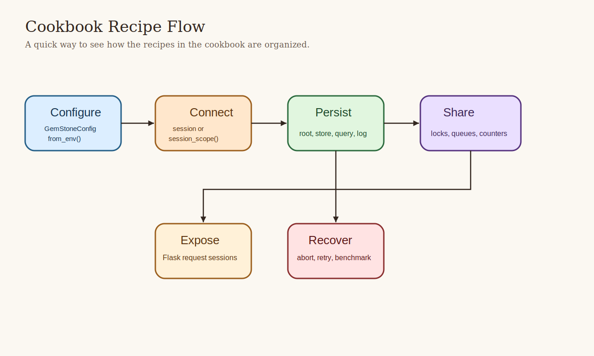

# Cookbook

This cookbook is a collection of direct recipes. Each one is deliberately short
enough to copy, adapt, and keep moving.



## Recipe 1: Open a Session and Evaluate Smalltalk

```python
from gemstone_py import GemStoneConfig, GemStoneSession

config = GemStoneConfig.from_env()

with GemStoneSession(config=config) as session:
    print(session.eval("3 factorial"))
```

Use this when:

- you want the smallest live sanity check
- you need to inspect a repository value quickly

## Recipe 2: Commit a Write Safely

```python
from gemstone_py import GemStoneConfig, TransactionPolicy, GemStoneSession
from gemstone_py.persistent_root import PersistentRoot

config = GemStoneConfig.from_env()

with GemStoneSession(
    config=config,
    transaction_policy=TransactionPolicy.COMMIT_ON_SUCCESS,
) as session:
    root = PersistentRoot(session)
    root["CookbookExample"] = {"answer": 42}
```

Why this recipe exists:

- it avoids the classic "the write seemed to work but vanished" mistake

## Recipe 3: Read From `PersistentRoot`

```python
from gemstone_py import GemStoneSession
from gemstone_py.persistent_root import PersistentRoot

with GemStoneSession(config=config) as session:
    root = PersistentRoot(session)
    print(root["CookbookExample"])
```

## Recipe 4: Use `session_scope(...)`

```python
from gemstone_py import GemStoneConfig, session_scope
from gemstone_py.persistent_root import PersistentRoot

config = GemStoneConfig.from_env()

with session_scope(config=config) as session:
    root = PersistentRoot(session)
    root["ScopedWork"] = {"kind": "unit-of-work"}
```

This is the recipe to prefer in application code.

## Recipe 5: Create a Named `GSCollection`

```python
from gemstone_py.gsquery import GSCollection

people = GSCollection("CookbookPeople", config=config)
people.insert({"name": "Ada", "city": "London"})
people.insert({"name": "Grace", "city": "New York"})
people.create_equality_index("city")
```

## Recipe 6: Search an Indexed Collection

```python
matches = people.search("city", "London")
for row in matches:
    print(row)
```

Use `GSCollection` when you need repeated search, not when you merely enjoy the
idea of repeated search.

## Recipe 7: Keep a Store-Like Dataset in `GStore`

```python
from gemstone_py.gstore import GStore

store = GStore("cookbook.db", config=config)
store["sku:hat"] = {"name": "Hat", "stock": 8}
store["sku:cape"] = {"name": "Cape", "stock": 3}
print(store["sku:hat"])
```

## Recipe 8: Append a Persistent Event Log Entry

```python
from gemstone_py.objectlog import ObjectLog

log = ObjectLog(config=config)
log.info("inventory_adjusted", {"sku": "hat", "delta": -1})
```

Later:

```python
for entry in log.entries():
    print(entry)
```

## Recipe 9: Share a Counter Between Sessions

```python
from gemstone_py.concurrency import RCCounter

with session_scope(config=config) as session:
    counter = RCCounter(session)
    counter += 1
```

Use shared counters when the number truly lives in GemStone, not when a local
integer would do and you are simply feeling theatrical.

## Recipe 10: Share a Queue

```python
from gemstone_py.concurrency import RCQueue
from gemstone_py.persistent_root import PersistentRoot

with session_scope(config=config) as session:
    root = PersistentRoot(session)
    root["WorkQueue"] = RCQueue(session)
```

## Recipe 11: Install Flask Request Sessions

```python
from flask import Flask
from gemstone_py import GemStoneConfig, install_flask_request_session

app = Flask(__name__)

install_flask_request_session(
    app,
    config=GemStoneConfig.from_env(),
    pool_size=4,
)
```

This is the default production-friendly shape.

## Recipe 12: Use a Thread-Local Provider for Simpler Hosting

```python
install_flask_request_session(
    app,
    config=GemStoneConfig.from_env(),
    thread_local=True,
)
```

Good when the server model is simple and you want one session per thread.

## Recipe 13: Inspect Provider Health

```python
from gemstone_py import flask_request_session_provider_snapshot

@app.get("/health/gemstone")
def gemstone_health():
    return flask_request_session_provider_snapshot()
```

Operational visibility is better than optimism.

## Recipe 14: Run the Maintained Benchmarks

```bash
gemstone-benchmarks --entries 500 --search-runs 20
```

Or emit JSON:

```bash
gemstone-benchmarks --json --output benchmark-report.json
```

## Recipe 15: Compare Benchmark Reports

```bash
gemstone-benchmark-compare old.json new.json --json --output compare.json
```

That turns performance arguments into evidence, which is disappointingly healthy.

## Recipe 16: Register a New Accepted Benchmark Baseline

```bash
gemstone-benchmark-baseline-register \
  benchmark-report.json \
  --manifest .github/benchmarks/index.json
```

## Recipe 17: Verify the Installed Artifact

```bash
python -m gemstone_py.api_contract --json
```

This is useful after installation, after release, and after any moment when you
feel your package metadata may have become sentient.

## Recipe 18: Run the Live Test Lane

```bash
GS_RUN_LIVE=1 ./scripts/run_live_checks.sh
```

Longer soak run:

```bash
GS_RUN_LIVE=1 GS_RUN_LIVE_SOAK=1 ./scripts/run_live_checks.sh
```

## Recipe 19: Understand Commit Conflicts Without Pretending They Are Rare


When multiple sessions modify overlapping state, conflicts are normal. The right
pattern is:

- keep the write unit small
- retry where appropriate
- do not treat conflict exceptions as a shocking personal betrayal

## Recipe 20: Learn a Queue With a Hat


The hat trick example is memorable because it teaches a real primitive through a
slightly ridiculous scenario. You should keep more examples like that in your
own codebase than you probably do.

## Recipe 21: Explain `gemstone-py` to a New Teammate

Use this sentence:

> "It is a Python package that talks directly to GemStone Smalltalk, keeps
> transactions explicit, gives us persistence helpers instead of a fake ORM, and
> already has real CI, release, benchmark, and live verification lanes."

That sentence has rescued several meetings already. At minimum, it should rescue yours.
