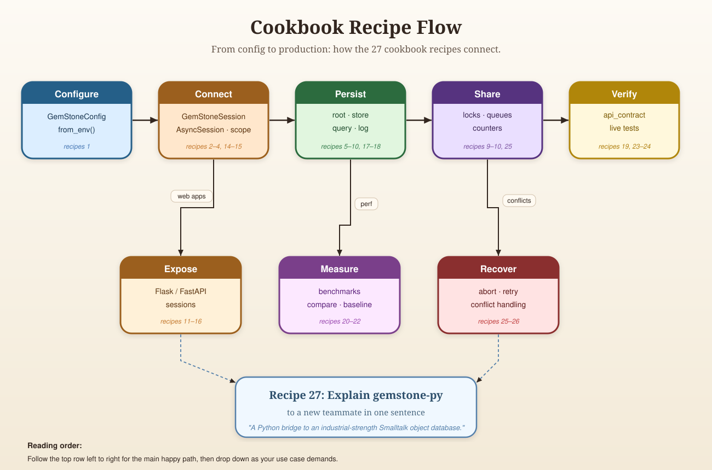

# Cookbook

This cookbook is a collection of direct recipes. Each one is deliberately short
enough to copy, adapt, and keep moving.



## Recipe 1: Open a Session and Evaluate Smalltalk

```python
from gemstone_py import GemStoneConfig, GemStoneSession

config = GemStoneConfig.from_env()

with GemStoneSession(config=config) as session:
    print(session.eval("3 factorial"))
```

Use this when:

- you want the smallest live sanity check
- you need to inspect a repository value quickly

## Recipe 2: Commit a Write Safely

```python
from gemstone_py import GemStoneConfig, TransactionPolicy, GemStoneSession
from gemstone_py.persistent_root import PersistentRoot

config = GemStoneConfig.from_env()

with GemStoneSession(
    config=config,
    transaction_policy=TransactionPolicy.COMMIT_ON_SUCCESS,
) as session:
    root = PersistentRoot(session)
    root["CookbookExample"] = {"answer": 42}
```

Why this recipe exists:

- it avoids the classic "the write seemed to work but vanished" mistake

## Recipe 3: Read From `PersistentRoot`

```python
from gemstone_py import GemStoneSession
from gemstone_py.persistent_root import PersistentRoot

with GemStoneSession(config=config) as session:
    root = PersistentRoot(session)
    print(root["CookbookExample"])
```

## Recipe 4: Use `session_scope(...)`

```python
from gemstone_py import GemStoneConfig, session_scope
from gemstone_py.persistent_root import PersistentRoot

config = GemStoneConfig.from_env()

with session_scope(config=config) as session:
    root = PersistentRoot(session)
    root["ScopedWork"] = {"kind": "unit-of-work"}
```

This is the recipe to prefer in application code.

## Recipe 5: Create a Named `GSCollection`

```python
from gemstone_py.gsquery import GSCollection

people = GSCollection("CookbookPeople", config=config)
people.insert({"@name": "Ada", "@city": "London"})
people.insert({"@name": "Grace", "@city": "New York"})
people.add_index("@city")
```

## Recipe 6: Search an Indexed Collection

```python
matches = people.search("@city", "eql", "London")
for row in matches:
    print(row)
```

Use `GSCollection` when you need repeated search, not when you merely enjoy the
idea of repeated search.

## Recipe 7: Keep a Store-Like Dataset in `GStore`

```python
from gemstone_py.gstore import GStore

store = GStore("cookbook.db", config=config)
store["sku:hat"] = {"name": "Hat", "stock": 8}
store["sku:cape"] = {"name": "Cape", "stock": 3}
print(store["sku:hat"])
```

## Recipe 8: Append a Persistent Event Log Entry

```python
from gemstone_py.objectlog import ObjectLog

log = ObjectLog(config=config)
log.info("inventory_adjusted", {"sku": "hat", "delta": -1})
```

Later:

```python
for entry in log.entries():
    print(entry)
```

## Recipe 9: Share a Counter Between Sessions

```python
from gemstone_py.concurrency import RCCounter

with session_scope(config=config) as session:
    counter = RCCounter(session)
    counter += 1
```

Use shared counters when the number truly lives in GemStone, not when a local
integer would do and you are simply feeling theatrical.

## Recipe 10: Share a Queue

```python
from gemstone_py.concurrency import RCQueue
from gemstone_py.persistent_root import PersistentRoot

with session_scope(config=config) as session:
    root = PersistentRoot(session)
    root["WorkQueue"] = RCQueue(session)
```

## Recipe 11: Install Flask Request Sessions

```python
from flask import Flask
from gemstone_py import GemStoneConfig
from gemstone_py.frameworks.flask import install_flask_request_session

app = Flask(__name__)

install_flask_request_session(
    app,
    config=GemStoneConfig.from_env(),
    pool_size=4,
)
```

This is the default production-friendly shape.

## Recipe 12: Use a Thread-Local Provider for Simpler Hosting

```python
install_flask_request_session(
    app,
    config=GemStoneConfig.from_env(),
    thread_local=True,
)
```

Good when the server model is simple and you want one session per thread.

## Recipe 13: Inspect Provider Health

```python
from gemstone_py import flask_request_session_provider_snapshot

@app.get("/health/gemstone")
def gemstone_health():
    return flask_request_session_provider_snapshot()
```

Operational visibility is better than optimism.

## Recipe 14: Build a Custom Web Adapter

```python
from gemstone_py import GemStoneConfig, RequestScope, TransactionPolicy
from gemstone_py.session_providers import GemStoneSessionPool

pool = GemStoneSessionPool(maxsize=4, config=GemStoneConfig.from_env())

scope = RequestScope(
    session_provider=pool,
    transaction_policy=TransactionPolicy.COMMIT_ON_SUCCESS,
)
session = scope.session()
try:
    session.eval("3 + 4")
finally:
    scope.finalize()
```

`RequestScope` is the framework-neutral sync lifecycle primitive behind Flask
request sessions. For async frameworks, pair `AsyncRequestScope` with
`AsyncSessionPool` and await `scope.finalize(...)` from request cleanup.

## Recipe 15: Open an Async Session

```python
from gemstone_py import GemStoneConfig
from gemstone_py.aio import AsyncSession

config = GemStoneConfig.from_env()

async with AsyncSession.connect(config=config) as session:
    print(await session.eval("3 + 4"))
```

Use this when the surrounding application is already async.

## Recipe 16: Use an Async Transaction

```python
async with AsyncSession.connect(config=config) as session:
    async with session.transaction():
        root = session.root()
        await root.set("AsyncCookbook", {"status": "ok"})
```

The transaction context commits on success and aborts on exception.

## Recipe 17: Add FastAPI Dependency Injection

```python
from fastapi import Depends, FastAPI
from gemstone_py import GemStoneConfig
from gemstone_py.aio import AsyncSession
from gemstone_py.aio.fastapi import session_dependency

app = FastAPI()
get_gemstone = session_dependency(config=GemStoneConfig.from_env())

@app.get("/health/gemstone")
async def gemstone_health(session: AsyncSession = Depends(get_gemstone)):
    return {"result": await session.eval("3 + 4")}
```

Django apps use the sync middleware adapter:

```python
from django.http import JsonResponse
from gemstone_py import GemStoneConfig
from gemstone_py.frameworks.django import GemStoneSessionMiddleware, request_session

def gemstone_session_middleware(get_response):
    return GemStoneSessionMiddleware(get_response, config=GemStoneConfig.from_env())

def gemstone_health(request):
    session = request_session(request)
    return JsonResponse({"result": session.eval("3 + 4")})
```

For Litestar, use the sibling async adapter:

```python
from litestar import Litestar, get
from litestar.di import Provide
from gemstone_py import GemStoneConfig
from gemstone_py.aio.litestar import session_dependency

get_gemstone = session_dependency(config=GemStoneConfig.from_env())

@get("/health/gemstone", dependencies={"session": Provide(get_gemstone)})
async def gemstone_health(session):
    return {"result": await session.eval("3 + 4")}

app = Litestar(route_handlers=[gemstone_health])
```

## Recipe 18: Query With a Typed Protocol

```python
from typing import Protocol
from gemstone_py.gsquery import GSCollection

class PostRecord(Protocol):
    title: str
    status: str

posts = GSCollection("SimplePosts", config=config).query(PostRecord)
for post in posts.where(lambda row: row.status == "published").all():
    print(post.title)
```

The lambda records an indexed GemStone path. It is not called for every row in
Python.

## Recipe 19: Generate a Typed Smalltalk Wrapper

```python
from typing import Protocol
from gemstone_py import gemstone_class, gemstone_selector

@gemstone_class("OkzBooking", async_=True)
class OkzBookingProto(Protocol):
    status: str

    @classmethod
    @gemstone_selector("findById:")
    def find_by_id(cls, booking_id: str) -> "OkzBookingProto":
        ...

    def mark_paid(self, at_posix_seconds: int) -> None:
        ...
```

Generate and check in the wrapper:

```bash
gemstone-codegen \
  --module examples.typed_access.codegen_demo.models \
  --output examples/typed_access/codegen_demo/generated \
  --clean
```

Use it without hand-writing the class-side Smalltalk string:

```python
from examples.typed_access.codegen_demo.generated import OkzBooking

booking = OkzBooking.find_by_id(session, "B-1001")
print(booking.status)
booking.mark_paid(1_779_912_000)
```

## Recipe 20: Keep an OOP Alive Explicitly

```python
with GemStoneSession(config=config) as session:
    ref = session.execute_managed("OrderedCollection new")
    ref.send("add:", session.new_string("kept"))
    print(ref.print_string())
    ref.close()
```

For a raw OOP:

```python
with session.handle(raw_oop) as handle:
    print(handle.send("printString"))
```

## Recipe 21: Check the Native Backend

```bash
python -m pip install "gemstone-py[fast]"
python -m examples.native_backend.check_backend
```

Force a backend before Python starts:

```bash
GEMSTONE_PY_GCI_BACKEND=ctypes python -m examples.native_backend.check_backend
GEMSTONE_PY_GCI_BACKEND=native python -m examples.native_backend.check_backend
```

## Recipe 22: Run the Maintained Benchmarks

```bash
gemstone-benchmarks --entries 500 --search-runs 20
```

Or emit JSON:

```bash
gemstone-benchmarks --json --output benchmark-report.json
```

## Recipe 23: Compare Benchmark Reports

```bash
gemstone-benchmark-compare old.json new.json --json --output compare.json
```

That turns performance arguments into evidence, which is disappointingly healthy.

## Recipe 24: Register a New Accepted Benchmark Baseline

```bash
gemstone-benchmark-baseline-register \
  benchmark-report.json \
  --manifest .github/benchmarks/index.json
```

## Recipe 25: Verify the Installed Artifact

```bash
python -m gemstone_py.api_contract --json
```

This is useful after installation, after release, and after any moment when you
feel your package metadata may have become sentient.

For a full PyPI/TestPyPI release check:

```bash
gemstone-publish-verify --gemstone-version 0.2.12 --native-version 0.1.2
```

That command checks project JSON, version-specific JSON, the simple index, and
temporary-virtualenv installs for both the pure package and native package.

## Recipe 26: Scaffold and Run Module-Style Migrations

Create a numbered migration file:

```bash
gemstone-migrations scaffold add_amount_to_booking --directory migrations
```

A migration module exposes `upgrade(session)`, optional `downgrade(session)`,
and optional `dependencies`:

```python
id = "002_add_amount_to_booking"
dependencies = ("001_initial",)

def upgrade(session):
    session.eval(
        "OkzBooking addInstVarName: 'amount' ifAbsent: [ nil ]"
    )
    session.commit()

def downgrade(session):
    session.eval(
        "OkzBooking removeInstVarName: 'amount' ifAbsent: [ nil ]"
    )
    session.commit()
```

Register modules in a manifest and apply them:

```python
from gemstone_py import GemStoneConfig, GemStoneSession
from gemstone_py.migrations import current_version, load_manifest, upgrade

steps = load_manifest("my_app.migrations.manifest")

with GemStoneSession(config=GemStoneConfig.from_env()) as session:
    print(current_version(session))
    print(upgrade(session, steps, dry_run=True))
    upgrade(session, steps)
```

Applied versions are recorded under `GemstonePyMigrations` in `UserGlobals`.
The runner refuses to continue when the stone has applied migrations that are
missing from the local manifest, or when a stored migration checksum differs
from the local file.
Real `upgrade` and `downgrade` runs acquire an advisory lock in `UserGlobals`
before applying steps; dry-runs do not.

The same operations are available from the command line:

```bash
gemstone-migrations current
gemstone-migrations status --manifest my_app.migrations.manifest
gemstone-migrations plan --manifest my_app.migrations.manifest
gemstone-migrations upgrade --manifest my_app.migrations.manifest --dry-run
gemstone-migrations upgrade --manifest my_app.migrations.manifest --dry-run --record
gemstone-migrations upgrade --manifest my_app.migrations.manifest
gemstone-migrations downgrade --manifest my_app.migrations.manifest --target 001_initial
```

For a stale lock left by a crashed process, use a deliberate override:

```bash
gemstone-migrations upgrade --manifest my_app.migrations.manifest \
  --force-lock --lock-owner release-2026-05-11
```

`--dry-run --record` uses a recording session for callbacks and prints common
session calls such as `session.eval(...)`, `execute(...)`, `perform_value(...)`,
`commit()`, and `abort()` without sending them to GemStone.

Example recorded output:

```text
dry-run upgrade: 1 step(s)
  002_add_amount_to_booking
recorded operations:
  # upgrade 002_add_amount_to_booking
  session.eval("OkzBooking addInstVarName: 'amount' ifAbsent: [ nil ]")
  session.commit()
```

Treat recorded dry-runs as a release review aid. Migrations that depend on live
query results still need a real staging run because the recorder returns
placeholder OOPs and never reads from GemStone.

To compare a local Protocol or type witness with the live GemStone class before
writing the next migration:

```bash
gemstone-migrations diff-class OkzBooking \
  --local-class my_app.models:OkzBookingProto
```

The output lists missing and extra instance variables and prints advisory
`session.eval(...)` lines for a reviewed migration.

## Recipe 27: Run the Live Test Lane

```bash
GS_RUN_LIVE=1 ./scripts/run_live_checks.sh
```

Longer soak run:

```bash
GS_RUN_LIVE=1 GS_RUN_LIVE_SOAK=1 ./scripts/run_live_checks.sh
```

## Recipe 28: Handle Commit Conflicts Without Pretending They Are Rare

When multiple sessions modify overlapping state, conflicts are normal. The right
pattern:

```python
from gemstone_py import GemStoneConfig, PersistentRoot, retrying_transaction

config = GemStoneConfig.from_env()

def increment_counter(session):
    # reload data each attempt; previous reads are stale after abort
    root = PersistentRoot(session)
    root["counter"] = (root.get("counter") or 0) + 1
    return root["counter"]

value = retrying_transaction(increment_counter, config=config, attempts=5)
```

Rules:

- keep the write unit small
- reload data after every abort — the previous read is stale
- bound the retry count — do not loop forever
- log conflicts — frequent conflicts signal a design smell, not bad luck

Add `on_conflict=` when you want a readable report for each retry:

```python
def log_retry(retry):
    print(retry.format(include_summaries=False))

retrying_transaction(
    increment_counter,
    config=config,
    attempts=5,
    on_conflict=log_retry,
)
```

## Recipe 29: Learn a Queue With a Hat

The hat trick example is memorable because it teaches a real primitive through a
slightly ridiculous scenario. You should keep more examples like that in your
own codebase than you probably do.

## Recipe 30: Explain `gemstone-py` to a New Teammate

Use this sentence:

> "It is a Python package that talks directly to GemStone Smalltalk, keeps
> transactions explicit, gives us persistence helpers instead of a fake ORM,
> supports async, typed access, managed OOP lifetimes, and optional native
> wheels, and already has real CI, release, benchmark, and live verification
> lanes."

That sentence has rescued several meetings already. At minimum, it should rescue yours.

## Recipe 31: Convert Scalar Values Explicitly

```python
from datetime import date
from decimal import Decimal
from gemstone_py import GemStoneConfig, GemStoneSession, scalar_value_converter_registry

registry = scalar_value_converter_registry()

with GemStoneSession(config=GemStoneConfig.from_env()) as session:
    invoice_oop = session.eval_oop("UserGlobals at: #CurrentInvoice")
    due_on, amount = registry.to_oops(session, [date(2026, 5, 15), Decimal("19.95")])
    session.perform_oop(invoice_oop, "dueOn:amount:", due_on, amount)
```

The built-in factories cover `datetime`, exact `date`, `Decimal`, and `UUID`.
`ValueConverterRegistry.copy()` and `extend(...)` make application-specific
registries cheap to assemble without global state.

For dataclasses, convert to a plain payload when that is what the GemStone-side
API expects:

```python
from gemstone_py import dataclass_to_dict

payload = dataclass_to_dict(booking_patch, recurse=False)
root["PendingBookingPatch"] = payload
```

Run the offline preview without a live stone:

```bash
gemstone-examples value-converters
python -m examples.cookbook.value_converters
```

## Recipe 32: Batch Root and Dictionary Access

```python
from gemstone_py import GemStoneConfig, PersistentRoot, session_scope

config = GemStoneConfig.from_env()

with session_scope(config=config) as session:
    root = PersistentRoot(session)

    values = root.get_many(["Settings", "VisitCount"], default=None)
    root.update_many({
        "VisitCount": int(values["VisitCount"] or 0) + 1,
        "LastMaintenance": "2026-05-14T22:00:00Z",
    })

    if "Settings" not in root:
        root["Settings"] = {}
    settings = root["Settings"]
    settings.update_many({"theme": "dark", "page_size": 50})
```

Use this when the operation is naturally a batch. It is still explicit
repository access, just less chatty.

For persistent ordered lists:

```python
from gemstone_py import PersistentRoot, session_scope
from gemstone_py.ordered_collection import OrderedCollection

with session_scope(config=config) as session:
    states = OrderedCollection(session)
    states.extend(["draft", "review", "paid"])
    PersistentRoot(session)["InvoiceStates"] = states
```

## Recipe 33: Send Selectors in Bulk

```python
from gemstone_py import GemStoneConfig, GemStoneSession, PerformCall

with GemStoneSession(config=GemStoneConfig.from_env()) as session:
    orders = [
        session.global_get("OrderA"),
        session.global_get("OrderB"),
    ]

    statuses = session.perform_many_value(orders, "status")
    labels = session.bulk_perform_calls_value([
        PerformCall(orders[0], "printString"),
        (orders[1], "status"),
    ])
```

Use `perform_many_*` for one selector across many receivers. Use
`bulk_perform_calls_*` when the receivers, selectors, or arguments differ.

## Recipe 34: Fingerprint Expected Schema

```bash
gemstone-migrations fingerprint \
  --root Bookings \
  --root BookingIndexes \
  --class OkzBooking \
  --manifest my_app.migrations.manifest \
  --json
```

For startup checks:

```python
from gemstone_py.migrations import assert_schema_fingerprint, load_manifest

steps = load_manifest("my_app.migrations.manifest")
assert_schema_fingerprint(
    session,
    expected_digest="...",
    root_keys=["Bookings", "BookingIndexes"],
    class_names=["OkzBooking"],
    migration_steps=steps,
)
```

Fingerprinting is for deployment confidence. It does not apply migrations or
infer Python object mappings.
