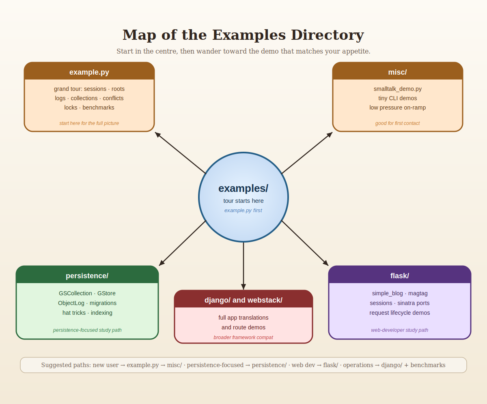

# Guide to the Examples

The `examples/` tree is one of the best parts of `gemstone-py`. It is broad
enough to teach the package properly, but disciplined enough that the examples
still map to the real API and current workflows.

## How to Use This Guide

This guide is organized around what you are trying to learn:

- first contact with a live GemStone session
- persistence helpers
- indexed collections and query-style access
- concurrency primitives
- Flask integration
- web app translations
- maintained benchmarks versus teaching examples

If you want the shortest path:

1. run `examples/example.py`
2. run `examples/misc/smalltalk_demo.py`
3. inspect one persistence example
4. inspect one Flask example

## `examples/example.py`: The Grand Tour

If you only run one example, run this one.

Why it matters:

- it exercises the major package surfaces in one file
- it demonstrates live session behaviour instead of abstract promises
- it shows transaction boundaries, cross-session reads, and conflict patterns

It covers:

- `SmalltalkBridge`
- `GemStoneSessionFacade`
- `PersistentRoot`
- `GStore`
- `ObjectLog`
- `RCCounter`
- `RCHash`
- `RCQueue`
- nested transactions
- `CommitConflictError`
- date/time conversions
- object locking
- instance listing

Treat it as the "here is what the package can really do" demo.

## `examples/misc/`

This is the low-pressure on-ramp.

Start here when:

- you want a tiny first success
- you want to confirm the environment is healthy
- you want a bridge demo without reading a hundred moving parts

The star here is `smalltalk_demo.py`, which now runs through the supported CLI
surface and shows the Smalltalk bridge without dragging in everything else.

## `examples/persistence/`

This is where the package stops being a client library and starts feeling like a
practical application toolkit.

Major themes in this tree:

- indexed collections
- stores
- data migration
- persistent data structures
- translation of old MagLev-era ideas into plain GemStone use

### Indexing

Files around `persistence/indexing/` show how to:

- create a dataset
- store rows in GemStone
- build indexes
- search efficiently

This is the right cluster to study when `PersistentRoot` starts to feel too
coarse-grained for the shape of your data.

### `GStore`

The `persistence/gstore/` example contrasts GemStone-backed storage with an
in-memory dict baseline. That makes it useful for both teaching and performance
intuition:

- you see the API shape
- you see the cost of persistence
- you do not need mythology to explain the result

### Hat Trick

The `hat_trick/` example is the kind of thing every useful repository-backed
toolkit should have: a weird little demo that is memorable enough to teach the
real abstraction.

Here the abstraction is queue-backed shared state:

- create a hat backed by `RCQueue`
- inspect the contents
- understand the relation between a playful example and a real concurrency primitive

The queue is not a toy. The hat is merely wearing formal attire.

### Migrations

The migrations examples are valuable because they show the package in an honest
"old data must become new data" mode.

Use these when you want patterns for:

- versioned domain objects
- chunked migration
- retry loops
- explicit transactional migration steps

## `examples/flask/`

This directory is where the request/session layer stops being theory.

Important sub-examples:

- `simple_blog/`
- `magtag/`
- `sessions/`
- `sinatra_port/`

### `simple_blog`

Good first Flask example because:

- the domain is small
- the persistence is recognizable
- the routes are ordinary enough to reason about quickly

Study this when you want:

- request session handling
- a simple persistent model
- proof that the package fits normal Flask structure

### `magtag`

This is a larger demonstration of the same core idea:

- Flask app
- GemStone-backed data
- `GSCollection` in a realistic setting

If `simple_blog` is the friendly coffee, `magtag` is the "all right, show me a
real screen and some real workflows" example.

### `sessions`

These examples focus on request/session lifecycle concerns. They are useful when
you care more about integration behaviour than about application domain logic.

## `examples/django/` and `examples/webstack/`

These matter for two reasons:

1. they prove the package is not locked into one tiny application style
2. they surface compatibility issues that smaller demos never trigger

The `webstack` examples are also useful for release verification because they
have enough app surface to catch missing imports, route regressions, and other
"this only broke in CI" problems.

## Examples vs Maintained Lanes

This distinction matters.

The examples are for learning and exploration.

The maintained lanes are:

- `./scripts/run_ci_checks.sh`
- `./scripts/run_live_checks.sh`
- `gemstone-benchmarks`
- the GitHub workflows under `.github/workflows/`

Do not confuse:

- "I ran a charming example"
- with
- "the package is verified against its supported workflows"

You need both. They are not interchangeable.

## Suggested Study Paths

### Path 1: New user

1. `examples/example.py`
2. `examples/misc/smalltalk_demo.py`
3. this guide again, now with less fear

### Path 2: Persistence-focused user

1. `examples/example.py`
2. `examples/persistence/indexing/*`
3. `examples/persistence/gstore/main.py`
4. `examples/persistence/migrations/*`

### Path 3: Web developer

1. `examples/flask/simple_blog/*`
2. `examples/flask/sessions/*`
3. `examples/flask/magtag/*`
4. `examples/webstack/*`

### Path 4: Concurrency-curious person

1. `examples/example.py`
2. hat trick queue demo
3. live tests around contention and retries

## Practical Advice

- run the examples from a configured environment, not from a shell that "mostly remembers" the right variables
- do not start with the biggest web example if you still do not know how `TransactionPolicy` works
- read the maintained benchmark docs before treating example performance output as policy
- keep the examples open next to the user manual; the two reinforce each other

## Closing Thought

The examples directory is not filler. It is one of the package's strongest
teaching tools, and it is worth reading like source documentation instead of
like a pile of promotional demos.
