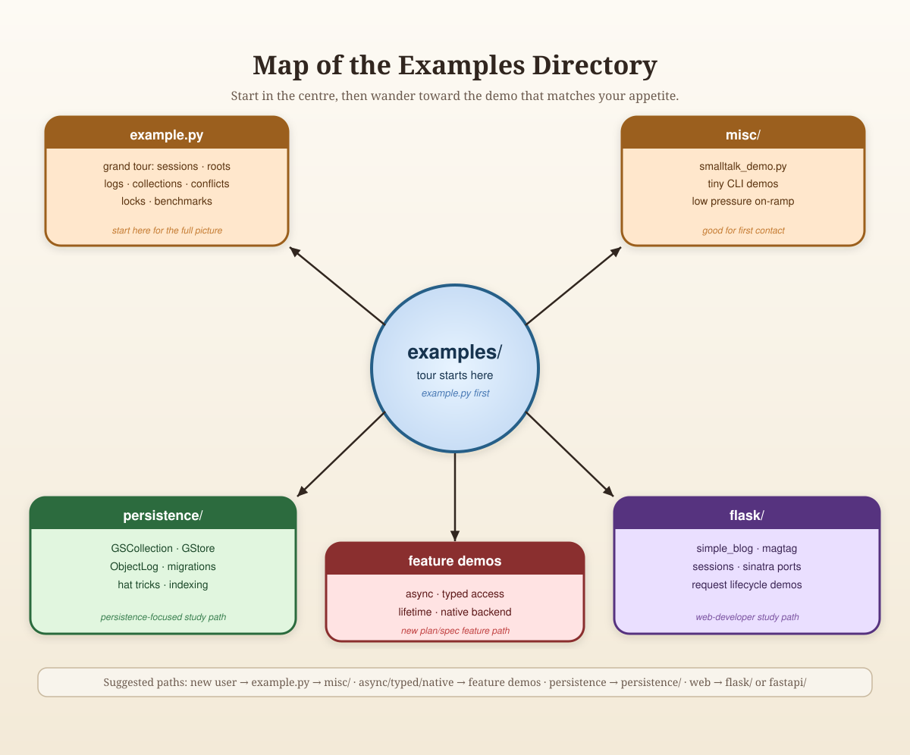

# Guide to the Examples

The `examples/` tree is one of the best parts of `gemstone-py`. It is broad
enough to teach the package properly, but disciplined enough that the examples
still map to the real API and current workflows.



## How to Use This Guide

This guide is organized around what you are trying to learn:

- first contact with a live GemStone session
- async sessions and FastAPI request integration
- typed OOPs, typed queries, and export-set lifetime handles
- persistence helpers
- indexed collections and query-style access
- concurrency primitives
- Flask integration
- optional native backend selection
- web app translations
- maintained benchmarks versus teaching examples

If you want the shortest path:

1. run `examples/example.py`
2. run `examples/misc/smalltalk_demo.py`
3. run one feature example from `async_features/`, `typed_access/`, or `lifetime/`
4. inspect one persistence example
5. inspect one Flask or FastAPI example

## Common Setup

Most live examples expect the same GemStone environment:

```bash
export GS_LIB=/opt/gemstone/product/lib
export GS_STONE=gs64stone
export GS_USERNAME=DataCurator
export GS_PASSWORD=swordfish
```

Run examples as modules from the repository root so imports resolve exactly as
they do in CI:

```bash
python -m examples.misc.smalltalk_demo
python -m examples.async_features.session_root_and_collection
```

For a normal installed package:

```bash
python -m pip install gemstone-py
```

For a source checkout with development tools:

```bash
python -m pip install -e .[dev]
```

For the optional native backend example:

```bash
python -m pip install "gemstone-py[fast]"
```

For FastAPI examples from an installed package:

```bash
python -m pip install "gemstone-py[fastapi]"
gemstone-fastapi-example --reload
```

For FastAPI examples from a source checkout:

```bash
python -m pip install -e ".[examples]"
python -m examples.fastapi.run --reload
```

## Running Examples From VS Code

The repository now includes `vscode-gemstone-py-workbench/`, a companion VS Code
extension scaffold for the Python-facing workflow. It adds a GemStone Py sidebar
with example runners, environment/backend checks, docs/PDF launchers,
maintainer scripts, Jasper links, and a launcher for
`python-gemstone-database-explorer`.

Install it from the Visual Studio Marketplace:

```bash
code --install-extension unicompute.gemstone-py-workbench
```

Marketplace page:
https://marketplace.visualstudio.com/items?itemName=unicompute.gemstone-py-workbench

During extension development:

```bash
cd vscode-gemstone-py-workbench
npm install
npm run compile
```

Then open the extension folder in VS Code and press `F5`. Configure the
`gemstonePy.env` settings with the same `GS_*` values shown above before
running live examples. Leave `gemstonePy.repoPath` empty when the current
workspace is the `gemstone-py` checkout, and set `gemstonePy.explorerPath` to a
local `python-gemstone-database-explorer` checkout when you want explorer
commands.

## `examples/example.py`: The Grand Tour

If you only run one example, run this one.

Why it matters:

- it exercises the major package surfaces in one file
- it demonstrates live session behaviour instead of abstract promises
- it shows transaction boundaries, cross-session reads, and conflict patterns

It covers:

- `SmalltalkBridge`
- `GemStoneSessionFacade`
- `PersistentRoot`
- `GStore`
- `ObjectLog`
- `RCCounter`
- `RCHash`
- `RCQueue`
- nested transactions
- `CommitConflictError`
- date/time conversions
- object locking
- instance listing

Treat it as the "here is what the package can really do" demo.

Usage:

```bash
python -m examples.example
```

The core shape is still ordinary session code:

```python
from gemstone_py import GemStoneConfig, GemStoneSession, TransactionPolicy
from gemstone_py.session_facade import GemStoneSessionFacade

config = GemStoneConfig.from_env()

with GemStoneSession(
    config=config,
    transaction_policy=TransactionPolicy.COMMIT_ON_SUCCESS,
) as session:
    facade = GemStoneSessionFacade(session)
    facade["ExampleDict"] = {"status": "ok"}
```

## `examples/misc/`

This is the low-pressure on-ramp.

Start here when:

- you want a tiny first success
- you want to confirm the environment is healthy
- you want a bridge demo without reading a hundred moving parts

The star here is `smalltalk_demo.py`, which now runs through the supported CLI
surface and shows the Smalltalk bridge without dragging in everything else.

Usage:

```bash
python -m examples.misc.smalltalk_demo
gemstone-smalltalk-demo
gemstone-examples smalltalk-demo
```

Representative code:

```python
from gemstone_py.example_support import MANUAL_POLICY, example_session
from gemstone_py.smalltalk_bridge import SmalltalkBridge

with example_session(transaction_policy=MANUAL_POLICY) as session:
    smalltalk = SmalltalkBridge(session)
    settings = smalltalk.StringKeyValueDictionary.new()
    settings["status"] = "ok"
    print(settings["status"])
```

## `examples/async_features/`

This directory demonstrates the async API added for modern Python application
stacks.

`session_root_and_collection.py` shows:

- `AsyncSession.connect(...)`
- `async with session.transaction()`
- `AsyncPersistentRoot`
- `AsyncManagedOop`
- `AsyncGSCollection`

Run it when the normal sync login works and you want to confirm that GCI work is
being routed through the async facade correctly.

Usage:

```bash
python -m examples.async_features.session_root_and_collection
```

Session and root access:

```python
from gemstone_py.aio import AsyncPersistentRoot, AsyncSession

async with AsyncSession.connect(config=config) as session:
    async with session.transaction():
        root = AsyncPersistentRoot(session)
        await root.set("AsyncExample", {"status": "async"})

    saved = await session.root().get("AsyncExample")
```

Async managed OOPs:

```python
ref = await session.execute_managed("OrderedCollection new")
try:
    first = await session.new_string("from async")
    await ref.send("add:", first)
    print(await ref.print_string())
finally:
    await ref.close()
```

Async indexed collection access:

```python
from gemstone_py.aio import AsyncGSCollection

collection = AsyncGSCollection("AsyncFeaturePeople", config=config)
await collection.bulk_insert([
    {"@name": "Ada", "@status": "active"},
    {"@name": "Grace", "@status": "inactive"},
])
await collection.add_index("@status")
active = await collection.search("@status", "eql", "active")
collection.close()
```

Use a generated or test-specific collection name in real scripts, and call
`AsyncGSCollection.drop(...)` during cleanup.

## `examples/typed_access/`

This directory covers the static typing stream from the plan.

Use it when you want to understand:

- `@gemstone_class(...)`
- `TypedOop[T]`
- `typed_oop(...)`
- typed `GSCollection.query(Protocol)` predicates

`simple_blog_queries.py` contains importable helper functions for the blog data
shape. `typed_oops_and_queries.py` is the runnable live example.

Usage:

```bash
python -m examples.typed_access.typed_oops_and_queries
```

Typed OOPs:

```python
from typing import Protocol
from gemstone_py import GemStoneSession, TransactionPolicy, gemstone_class

@gemstone_class("Date")
class GemStoneDate(Protocol):
    @property
    def printString(self) -> str:
        ...

with GemStoneSession(
    config=config,
    transaction_policy=TransactionPolicy.ABORT_ON_EXIT,
) as session:
    today = session.execute_typed("Date today", GemStoneDate)  # type: ignore[type-abstract]
    print(today.gemstone_class_name)
    print(today.proxy().printString)
```

Typed `GSCollection` queries:

```python
from typing import Protocol
from gemstone_py.gsquery import GSCollection

class BlogPostRecord(Protocol):
    title: str
    status: str

posts = GSCollection("SimplePosts", config=config)
published = posts.query(BlogPostRecord).where(
    lambda post: post.status == "published"
).all()

for post in published:
    print(post.title)
```

The lambda records a GemStone ivar path. It is not a Python-side row filter.

## `examples/lifetime/`

`managed_oop_handles.py` is the focused example for the OOP lifetime model.

It demonstrates:

- `execute_managed(...)` for automatic export-set retention
- `ManagedOop.close()` for explicit cleanup
- `session.handle(raw_oop)` for scoped retention when you already have an OOP

Read this before holding raw OOP integers across operations that might trigger
GemStone-side garbage collection.

Usage:

```bash
python -m examples.lifetime.managed_oop_handles
```

Managed handle:

```python
collection = session.execute_managed("OrderedCollection new")
try:
    collection.send("add:", session.new_string("managed"))
    session.eval("System startGcAndCommit")
    print(collection.print_string())
finally:
    collection.close()
```

Scoped raw-OOP handle:

```python
raw_oop = session.execute_oop("OrderedCollection new")
with session.handle(raw_oop) as handle:
    handle.send("add:", session.new_string("scoped"))
    print(handle.send("printString"))
```

Use `execute_managed(...)` for object references you want Python to retain
automatically. Use `session.handle(...)` when an existing raw OOP only needs to
be protected inside a known block.

## `examples/native_backend/`

`check_backend.py` prints the selected low-level GCI backend and whether the
optional native extension is importable.

Use it after:

```bash
python -m pip install "gemstone-py[fast]"
```

It is also useful when comparing benchmark reports with
`GEMSTONE_PY_GCI_BACKEND=ctypes` and `GEMSTONE_PY_GCI_BACKEND=native`.

Usage:

```bash
python -m examples.native_backend.check_backend
GEMSTONE_PY_GCI_BACKEND=ctypes python -m examples.native_backend.check_backend
GEMSTONE_PY_GCI_BACKEND=native python -m examples.native_backend.check_backend
```

The code is deliberately tiny:

```python
from gemstone_py import _gci
from gemstone_py.native import native_fast_path_available

print(_gci.IMPLEMENTATION)
print(native_fast_path_available())
```

Backend selection happens when Python imports `gemstone_py._gci`, so set
`GEMSTONE_PY_GCI_BACKEND` before starting Python.

## `examples/persistence/`

This is where the package stops being a client library and starts feeling like a
practical application toolkit.

Major themes in this tree:

- indexed collections
- stores
- data migration
- persistent data structures
- translation of old MagLev-era ideas into plain GemStone use

### Indexing

Files around `persistence/indexing/` show how to:

- create a dataset
- store rows in GemStone
- build indexes
- search efficiently

This is the right cluster to study when `PersistentRoot` starts to feel too
coarse-grained for the shape of your data.

Usage:

```bash
python -m examples.persistence.indexing.create_random_people
python -m examples.persistence.indexing.search_random_people
python -m examples.persistence.indexing.index_example
```

The useful API shape:

```python
from gemstone_py.gsquery import GSCollection

people = GSCollection("People", config=config)
people.bulk_insert([
    {"@name": "Ada", "@age": 36},
    {"@name": "Grace", "@age": 42},
])
people.add_index_for_class("@age", "SmallInt")
matches = people.search("@age", "gte", 40)
```

### `GStore`

The `persistence/gstore/` example contrasts GemStone-backed storage with an
in-memory dict baseline. That makes it useful for both teaching and performance
intuition:

- you see the API shape
- you see the cost of persistence
- you do not need mythology to explain the result

Usage:

```bash
python -m examples.persistence.gstore.main
```

Typical store-shaped code:

```python
from gemstone_py.gstore import GStore

store = GStore("inventory.db", config=config)
store["sku:hat"] = {"name": "Hat", "stock": 8}
print(store["sku:hat"])
```

### Hat Trick

The `hat_trick/` example is the kind of thing every useful repository-backed
toolkit should have: a weird little demo that is memorable enough to teach the
real abstraction.

Here the abstraction is queue-backed shared state:

- create a hat backed by `RCQueue`
- inspect the contents
- understand the relation between a playful example and a real concurrency primitive

The queue is not a toy. The hat is merely wearing formal attire.

Usage:

```bash
python -m examples.persistence.hat_trick.create_hat
python -m examples.persistence.hat_trick.add_rabbit_to_hat
python -m examples.persistence.hat_trick.show_hat_contents
```

The pattern behind the example is reduced-conflict queue-backed state:

```python
from gemstone_py.concurrency import RCQueue
from gemstone_py.persistent_root import PersistentRoot

root = PersistentRoot(session)
root["WorkQueue"] = RCQueue(session)
root["WorkQueue"].push("first job")
```

### Migrations

The migrations examples are valuable because they show the package in an honest
"old data must become new data" mode.

Use these when you want patterns for:

- versioned domain objects
- chunked migration
- retry loops
- explicit transactional migration steps

Usage:

```bash
python -m examples.persistence.migrations.write_posts
python -m examples.persistence.migrations.migrate
python -m examples.persistence.migrations.migrate_by_chunks
```

The key habit is to keep migration units explicit:

```python
from gemstone_py import session_scope

with session_scope(config=config) as session:
    # read old shape
    # write new shape
    # commit happens only if the block succeeds
    ...
```

## `examples/flask/`

This directory is where the request/session layer stops being theory.

Important sub-examples:

- `simple_blog/`
- `magtag/`
- `sessions/`
- `sinatra_port/`

### `simple_blog`

Good first Flask example because:

- the domain is small
- the persistence is recognizable
- the routes are ordinary enough to reason about quickly

Study this when you want:

- request session handling
- a simple persistent model
- proof that the package fits normal Flask structure

Usage:

```bash
python -m examples.flask.simple_blog.blog_app
```

Request-scoped work should use the installed session integration:

```python
from flask import Flask
from gemstone_py import GemStoneConfig, install_flask_request_session

app = Flask(__name__)
install_flask_request_session(
    app,
    config=GemStoneConfig.from_env(),
    pool_size=4,
)
```

### `magtag`

This is a larger demonstration of the same core idea:

- Flask app
- GemStone-backed data
- `GSCollection` in a realistic setting

If `simple_blog` is the friendly coffee, `magtag` is the "all right, show me a
real screen and some real workflows" example.

Usage:

```bash
python -m examples.flask.magtag.magtag_app
```

The model layer uses `GSCollection` for lookup-heavy records:

```python
from gemstone_py.gsquery import GSCollection

users = GSCollection("MagTagUsers")
users.add_index_for_class("@name", "String")
matches = users.search("@name", "eql", "pbm0")
```

### `sessions`

These examples focus on request/session lifecycle concerns. They are useful when
you care more about integration behaviour than about application domain logic.

Usage:

```bash
python -m examples.flask.sessions.msessions
```

Provider health can be inspected without reaching into private Flask state:

```python
from gemstone_py import flask_request_session_provider_snapshot

snapshot = flask_request_session_provider_snapshot(app)
if snapshot is not None:
    print(snapshot.available, snapshot.in_use, snapshot.created)
```

## `examples/fastapi/`

This is the smallest async web example. It uses `session_dependency(...)` to
open one `AsyncSession` per request and commit or abort with the request
outcome.

Usage:

```bash
python -m pip install -e ".[examples]"
python -m examples.fastapi.run --reload
```

When the server starts, you should see output like:

```text
INFO:     Will watch for changes in these directories: ['/path/to/gemstone-py']
INFO:     Uvicorn running on http://127.0.0.1:8000 (Press CTRL+C to quit)
INFO:     Started reloader process [49045] using WatchFiles
INFO:     Started server process [49048]
INFO:     Waiting for application startup.
INFO:     Application startup complete.
```

With that server running, test it from a second terminal.

Basic checks:

```bash
curl -i http://127.0.0.1:8000/
```

Expected:

```text
HTTP/1.1 200 OK
```

Body should include:

```json
{"name":"gemstone-py FastAPI example","endpoints":{"health":"/health/gemstone","docs":"/docs","openapi":"/openapi.json"}}
```

Then test the GemStone endpoint:

```bash
curl -i http://127.0.0.1:8000/health/gemstone
```

Expected if GemStone credentials/environment are set and the stone is reachable:

```json
{"result":7}
```

Also open these in a browser:

```text
http://127.0.0.1:8000/
http://127.0.0.1:8000/docs
http://127.0.0.1:8000/health/gemstone
```

Endpoint shape:

```python
from fastapi import Depends, FastAPI
from gemstone_py import GemStoneConfig
from gemstone_py.aio import AsyncSession
from gemstone_py.aio.fastapi import session_dependency

app = FastAPI()
get_gemstone_session = session_dependency(config=GemStoneConfig.from_env())

@app.get("/health/gemstone")
async def gemstone_health(session: AsyncSession = Depends(get_gemstone_session)):
    return {"result": await session.eval("3 + 4")}
```

## `examples/django/` and `examples/webstack/`

These matter for two reasons:

1. they prove the package is not locked into one tiny application style
2. they surface compatibility issues that smaller demos never trigger

The `webstack` examples are also useful for release verification because they
have enough app surface to catch missing imports, route regressions, and other
"this only broke in CI" problems.

Usage:

```bash
cd examples/django/myapp
python manage.py migrate
python manage.py runserver
```

```bash
python -m examples.webstack.magtag_app
```

## Examples vs Maintained Lanes

This distinction matters.

The examples are for learning and exploration.

The maintained lanes are:

- `./scripts/run_ci_checks.sh`
- `./scripts/run_live_checks.sh`
- `gemstone-benchmarks`
- the GitHub workflows under `.github/workflows/`

Do not confuse:

- "I ran a charming example"
- with
- "the package is verified against its supported workflows"

You need both. They are not interchangeable.

## Suggested Study Paths

### Path 1: New user

1. `examples/example.py`
2. `examples/misc/smalltalk_demo.py`
3. this guide again, now with less fear

### Path 2: Persistence-focused user

1. `examples/example.py`
2. `examples/persistence/indexing/*`
3. `examples/persistence/gstore/main.py`
4. `examples/persistence/migrations/*`

### Path 3: Async or FastAPI user

1. `examples/async_features/session_root_and_collection.py`
2. `examples/fastapi/app.py`
3. `tests/test_live_async_integration.py`

### Path 4: Typed API user

1. `examples/typed_access/typed_oops_and_queries.py`
2. `examples/typed_access/simple_blog_queries.py`
3. `tests/test_typed_oop_lifetime.py`
4. `tests/test_gsquery.py`

### Path 5: Web developer

1. `examples/flask/simple_blog/*`
2. `examples/flask/sessions/*`
3. `examples/flask/magtag/*`
4. `examples/fastapi/app.py`
5. `examples/webstack/*`

### Path 6: Concurrency-curious person

1. `examples/example.py`
2. hat trick queue demo
3. live tests around contention and retries

### Path 7: Packaging and performance user

1. `examples/native_backend/check_backend.py`
2. `gemstone-benchmarks --suite gci --entries 1000000`
3. `./scripts/run_native_checks.sh`

## Practical Advice

- run the examples from a configured environment, not from a shell that "mostly remembers" the right variables
- do not start with the biggest web example if you still do not know how `TransactionPolicy` works
- read the maintained benchmark docs before treating example performance output as policy
- keep the examples open next to the user manual; the two reinforce each other

## Closing Thought

The examples directory is not filler. It is one of the package's strongest
teaching tools, and it is worth reading like source documentation instead of
like a pile of promotional demos.
