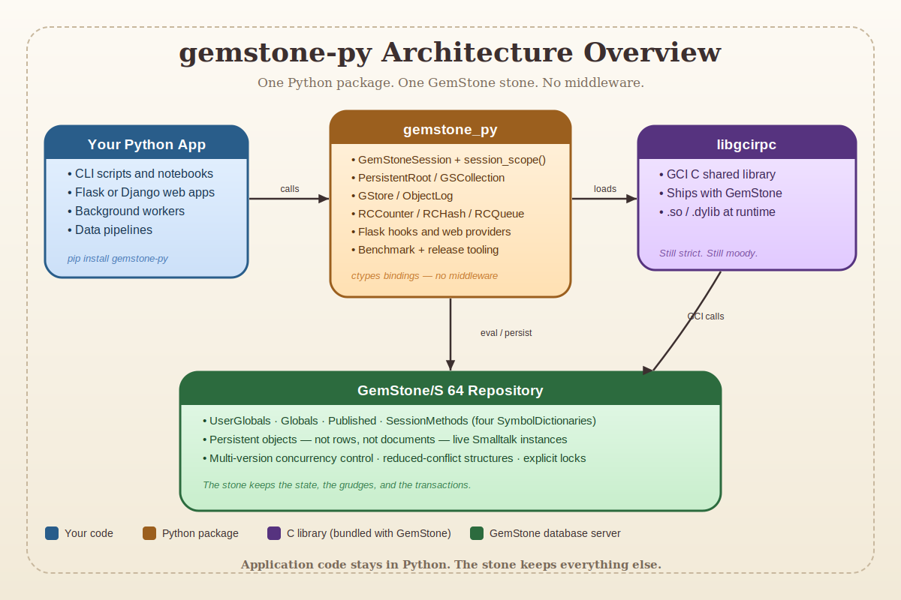
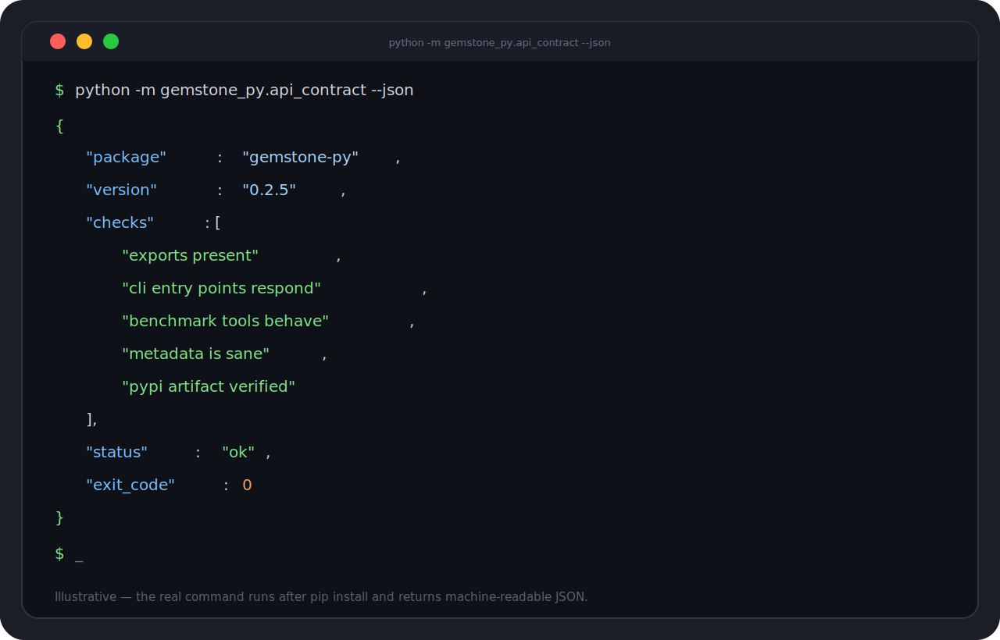

# Part I: Why gemstone-py Exists

## The Elevator Pitch

If somebody corners you near a whiteboard and asks what this package is, say:

> "`gemstone-py` is a Python package that talks directly to GemStone Smalltalk,
> keeps transaction intent explicit, and provides persistence, query, logging,
> concurrency, web, benchmark, and release tooling around that core."

That is the sober pitch.

The unsober pitch is:

> "It is what happens when a Python package decides that vague database magic is
> overrated and repository-backed honesty is more interesting."

Both are true. One is more likely to get you invited back to meetings.

\newpage

## The Problem Behind the Package

Talking to GemStone from Python sounds simple right up until the moment you need
to do it in a way that:

- works repeatedly
- survives packaging
- survives release automation
- behaves correctly under web request lifecycles
- handles commit conflicts like an adult
- and still has examples clear enough for a new user

Without a real package, teams drift toward a recognizable archeological layer:

- one script that loads `libgcirpc` directly
- one script that mostly works but depends on the author's shell history
- one Flask integration that silently commits on a handled `500`
- one benchmark nobody trusts
- and one README that starts with confidence and ends with folklore

The point of `gemstone-py` is to avoid that outcome.

\newpage

## The Package's Temperament

`gemstone-py` is opinionated in a specific way:

- it prefers explicit transaction policy
- it prefers tested installable artifacts over checkout-only convenience
- it prefers maintained examples over nostalgic stubs
- it prefers benchmark evidence over volume
- it prefers boring release automation over brave improvisation

This is good news for users and mildly disappointing news for chaos.

You will notice the package is not trying to become:

- a mystical ORM
- a general-purpose object database tutorial
- a framework that pretends GemStone no longer exists

It remains a Python package for people who know that the stone is real and the
repository is not a metaphor.

\newpage

## The Stack in One Picture

Read the diagram from left to right:

1. your Python code
2. the `gemstone_py` layer
3. `libgcirpc`
4. the GemStone repository

That picture matters because it prevents two common misunderstandings.

The first misunderstanding is that Python somehow "becomes" GemStone. It does
not. Python stays Python.

The second misunderstanding is that all persistence helpers are merely local
objects with a distant hobby. They are not. The data structures they front are
real repository state.

\newpage

## Why the Package Is Better Than a Pile of Glue

A pile of glue can absolutely talk to a stone.

It can also:

- leak transaction assumptions
- hide login behaviour in global state
- ship with unrepeatable environment instructions
- and become terrifying the first time a release workflow must publish to PyPI

`gemstone-py` is better than that because it has already done the boring work:

- packaging
- typing
- unit tests
- live tests
- benchmark reports
- benchmark comparison
- baseline management
- TestPyPI
- PyPI
- post-release verification
- self-hosted runner documentation

There is no glamour in this list, which is exactly why it is valuable.

\newpage

## A Brief Tour of the Public Surface

At the highest level, the package gives you:

- `GemStoneConfig`
- `GemStoneSession`
- `TransactionPolicy`
- `session_scope(...)`
- `PersistentRoot`
- `GSCollection`
- `GStore`
- `ObjectLog`
- concurrency helpers
- Flask request-session providers
- benchmarks and release utilities

That list is broad, but it is not random.

It maps to the actual lifecycle of production software:

1. connect
2. do work
3. persist state
4. expose it through an app
5. survive contention
6. measure it
7. release it

That is a proper narrative arc. It is almost heroic. Only the benchmark JSON
reports prevent it from becoming fantasy literature.

\newpage

## The Package Is Also a History Lesson

One subtle thing `gemstone-py` does well is acknowledge ancestry without
trapping itself inside it.

There are older traditions around GemStone and MagLev-style workflows that
influenced how people originally approached this space. The current package does
not deny that history. It simply refuses to keep dragging unnecessary runtime
assumptions into the present.

That is why the package now emphasizes:

- plain GemStone support
- explicit packaging
- maintained workflows
- current examples

You inherit the useful ideas without keeping the old scaffolding that no longer
helps.

\newpage

## The First Joke You Should Internalize

Every ecosystem has a joke that secretly contains its survival guide.

In this one, the joke is:

> "The stone remembers everything, including your mistakes."

Funny? Mildly.

Useful? Extremely.

GemStone is persistent. That means:

- your writes matter
- your commits matter
- your names matter
- your migrations matter

The package will help you, but it will not infantilize the repository into a
temporary playground. That is a feature.

\newpage

## What You Should Expect as a User

You should expect three things from `gemstone-py`.

First, clarity.

The package increasingly chooses explicit policy over convenience that only
feels friendly until it corrupts a workflow.

Second, maintained examples.

The examples are not decorative garnish. They are part of the teaching surface.

Third, operational seriousness.

The package now publishes, verifies, benchmarks, compares, and checks itself in
ways that many far larger projects postpone indefinitely.

So the promise is not "magic persistence."

The promise is:

> "A disciplined Python surface over GemStone, with enough tooling that you can
> trust what the package claims."

\newpage

## What You Should Not Expect

You should not expect:

- accidental auto-commit everywhere
- a fake ORM that hides repository semantics until the worst possible moment
- examples that teach one API while the package ships another
- benchmark claims without artifacts
- release claims without proof

The package has worked hard to stop doing those things.

The result is sometimes slightly less cuddly than a typical convenience library.
It is also vastly easier to defend in front of other engineers.

\newpage

## Screenshot Intermission

One of the nicer signs of maturity in a package is when it can verify itself in
a machine-readable way after installation.

`gemstone-py` has that.

That means users do not have to interpret success based on the emotional tone of
one print statement and a half-finished shell script.

\newpage

## The Human Value of a Good Setup Story

This package now has a setup story, a manual, examples, a cookbook, benchmark
policy, release policy, runner docs, and post-release verification. That sounds
administrative until you have lived without it.

Without those things:

- onboarding is guesswork
- release day is improvisation
- benchmarks are mythology
- and the person who knows how it works becomes a bottleneck with a pulse

With those things:

- new users start faster
- maintainers sleep better
- the repository has fewer secrets

That is not just technical quality. That is social quality.

\newpage

## Why This Introduction Is So Long

You may reasonably ask why a package introduction needs to be this long.

Three reasons:

1. because GemStone is important enough to deserve a proper explanation
2. because production packages benefit from narrative documentation, not only reference pages
3. because the author of this book clearly believes that jokes and page breaks are cheaper than confusion

The third reason is, admittedly, difficult to refute.

\newpage

## End of Part I

You now know:

- why the package exists
- what problem it solves
- what sort of package it is trying to be
- what promises it actually makes

Next comes the real center of gravity: sessions and transactions.

That is where most users either become comfortable or become poets of regret.

\newpage

## Part I Notes Page

- Package goal: direct, disciplined GemStone access from Python
- Central virtues: explicit policy, maintained examples, release proof, benchmark proof
- Central warning: the repository is persistent and remembers your behaviour

If you remember only one line from this part, make it this one:

> Convenience is nice. Correct transaction boundaries are nicer.
