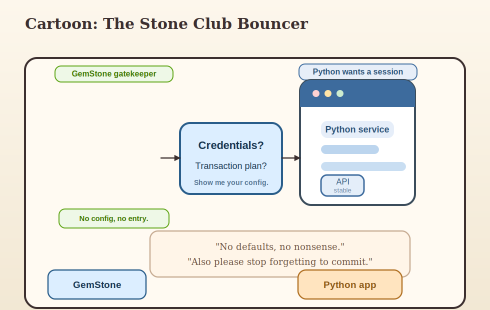

# Part II: Sessions and Transactions

## Opening Claim

If Part I explained why the package exists, Part II explains whether it will
behave when money, users, or deadlines are involved.

That behaviour lives in sessions and transactions.

This is where many persistence systems become vague. `gemstone-py` has instead
become rather blunt, which is healthy.


## What a Session Is

A `GemStoneSession` is a live connection to the stone through the GCI client
library. It is not:

- a Python-only cache
- a decorative context manager
- a magical bundle of database vibes

It is the thing through which real repository work happens.

When you open a session, you are establishing a concrete relationship with the
stone. That relationship includes:

- login state
- active transaction state
- visibility of committed and uncommitted work
- failure modes that are more honest than most web developers prefer before lunch


## Configuration First, Not Last

Sessions are built from configuration, and that is one of the package's most
important improvements over the "just pass strings around until something works"
school of engineering.

`GemStoneConfig.from_env()` is the normal entry point.

This is valuable because:

- credentials are validated explicitly
- host and stone settings are centralized
- the same config object can be shared by sessions, stores, benchmarks, and web providers

It also means your login story can be explained in one sentence instead of six
fragments and a shrug.


## The Session Lifecycle in One Diagram


What the diagram is telling you:

1. load configuration
2. open a session
3. do work in a transaction
4. either commit or abort

That is all.

That is also everything.

Many bad persistence stories happen because somebody mentally removed step 4 and
replaced it with "the library will surely do what I meant." This package works
hard to stop that sentence from succeeding.


## Manual Is the Honest Default

One of the most consequential package decisions is that `GemStoneSession(...)`
defaults to `TransactionPolicy.MANUAL`.

At first this sounds slightly severe. Then you remember what hidden auto-commit
behaviour does to teams, and it starts to sound merciful.

Manual means:

- session exit does not imply commit
- writes are not made durable by accident
- low-level code does not hide mutation semantics

The price is that you must think. The reward is that your data model is not held
together by misunderstood context manager etiquette.


## The Three Policies

You should treat `TransactionPolicy` like traffic signage rather than flavor text.

### `MANUAL`

Use when:

- you want direct control
- you are writing infrastructure or lower-level code
- you will call `commit()` or `abort()` yourself

### `COMMIT_ON_SUCCESS`

Use when:

- the work in the block is one clear write unit
- success should publish the change
- exceptions should roll it back

### `ABORT_ON_EXIT`

Use when:

- the work is read-only or exploratory
- you want a guaranteed clean exit

None of these are abstract philosophy. They are repository behaviour.


## `session_scope(...)` Is the Friendly Path

If `GemStoneSession` is the direct instrument, `session_scope(...)` is the
musically literate friend who reminds you what key the song is in.

It is usually the better choice for application code because it makes the unit
of work obvious:

- enter scope
- do the work
- commit on success
- abort on failure

This pattern fits services and request handlers naturally. It also keeps commit
semantics close to the application boundary, which is a polite way of saying
"fewer people will accidentally commit from somewhere bizarre."


## The Classic Mistake: "It Worked, But the Data Is Gone"

This sentence is so common it deserves a plaque.

What it usually means:

- you wrote data
- you saw it inside the current transaction
- you exited a manual session
- you never committed

The package did not betray you. The package did exactly what you told it to do.

The fix is not a mysterious GemStone ritual. The fix is one of:

- use `COMMIT_ON_SUCCESS`
- use `session_scope(...)`
- call `commit()` explicitly


## A Relationship Analogy, Unfortunately Accurate

Sessions are like relationships. Transaction policies are like boundaries.

Manual:

> "We should be explicit about expectations."

Commit on success:

> "If this goes well, we are telling the world."

Abort on exit:

> "This was just coffee. No assumptions."

The analogy becomes less funny once you realize how many production bugs come
from engineers who treat all three states as emotionally interchangeable.


## Nested Transactions and Conflict Handling

The package includes nested transaction helpers because real applications do not
remain single-layered for long.

Nested transactions are useful when:

- outer work should survive
- inner work may fail or conflict
- you want a smaller retryable unit inside a larger operation

That is not an exotic pattern. It is ordinary once your system has enough moving
parts to deserve tests and a pager.

The important rule is to keep the retryable section as small and concrete as
possible. Retrying half a business workflow is a confession, not a design.


## Aborts Are Not Shameful

Many teams talk about aborts as though they were embarrassing accidents. In a
transactional system, aborts are simply one of the valid outcomes.

You abort because:

- the work was exploratory
- an exception happened
- a conflict occurred
- the request ended in failure
- you are preserving a clean transactional story

An abort is often proof that the package is doing its job.

The shame would be half-committed state dressed up as success.


## What Web Integration Changed

One of the meaningful hardening changes in the package was to make Flask request
session finalization happen in teardown rather than pretending an `after_request`
hook could safely decide the world.

That matters because handled `500` paths exist.

If the request lifecycle commits too early, you get a nasty class of bugs:

- the app returns an error
- the user sees failure
- but partial repository work still commits

That kind of bug is pure administrative sorrow. The package has already done the
work to avoid it, which means users should actually use the provided web helpers.


## Session Pools and Thread-Local Providers

As soon as you move into web applications, session reuse enters the chat.

The package offers:

- `GemStoneSessionPool`
- `GemStoneThreadLocalSessionProvider`

The pool is the more generally production-friendly option:

- bounded reuse
- explicit close and health tracking
- better operational visibility

The thread-local provider is simpler when your hosting model is stable and one
session per thread is the clearest story.

Neither option changes the central truth:

the session still represents a real transactional relationship with the stone.


## A Bouncer Cartoon Because You Have Earned It



This cartoon is silly, but the caption is not:

> "No defaults, no nonsense. Also please stop forgetting to commit."

That is approximately the package's approach to transaction design.


## Practical Session Rules

If you want a short operational checklist:

1. build config once
2. use `session_scope(...)` for normal units of work
3. reserve raw manual sessions for infrastructure or scripts
4. commit only when success is clear
5. abort without shame
6. let request teardown own final web transaction state
7. assume conflicts will happen eventually

These rules are not glamorous. They are reliable.


## A Tiny Worked Example

Here is the most important write pattern in the whole package:

```python
from gemstone_py import GemStoneConfig, session_scope
from gemstone_py.persistent_root import PersistentRoot

config = GemStoneConfig.from_env()

with session_scope(config=config) as session:
    root = PersistentRoot(session)
    root["Users"] = {"count": 1}
```

This small example already tells a useful story:

- config is explicit
- the session is scoped
- commit behaviour is clear
- data goes to a named repository location

Many production features are just more ambitious versions of this sentence.


## End of Part II

If you understand this part, you understand the package's moral center.

Next we move into the first major persistence abstraction: `PersistentRoot`.

That is where things become both friendlier and slightly more dangerous, because
now the names you choose start to become part of the repository's public memory.


## Part II Notes Page

- Session = real connection plus transaction state
- Default session policy = manual
- Best normal application path = `session_scope(...)`
- Aborts are healthy
- Request teardown owns final Flask transaction outcome

If you remember only one line from this part, make it this one:

> Explicit transaction policy is a kindness to your future self.
