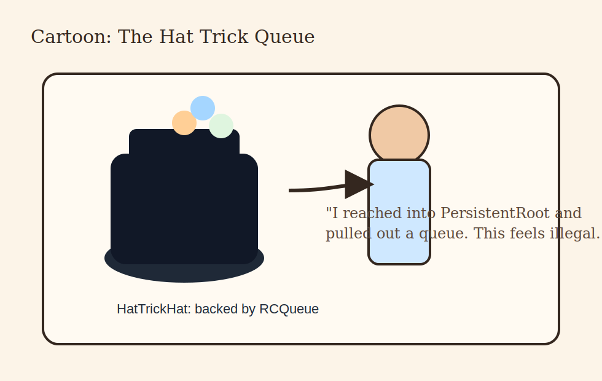

# Part III: PersistentRoot and Friends

## Opening Observation

When people first arrive at `PersistentRoot`, they often experience a pleasant
moment of relief.

After sessions, policies, and login details, here at last is something
comfortingly direct:

```python
root["MyThing"] = {...}
```

Yes. Exactly. That is why people like it.

It is also why people can get themselves into trouble with it if they mistake
directness for absence of consequence.


## What `PersistentRoot` Really Is

`PersistentRoot(session)` is the friendly Python surface over GemStone-backed
named repository dictionaries, especially `UserGlobals`.

The package also gives you:

- `PersistentRoot.globals(session)`
- `PersistentRoot.published(session)`
- `PersistentRoot.session_methods(session)`

This matters because GemStone already has the idea of named global dictionaries.
The library is not inventing fake storage out of local Python air. It is giving
you a manageable way to work with repository-native structures.


## Why Users Love It Immediately

Three reasons:

1. It is easy to explain.
2. It is easy to inspect.
3. It makes persistent state feel legible.

There is enormous value in being able to say:

> "This application stores its top-level state under these named keys."

That sentence is both technical and social. It helps the code and the humans.


## The Four Symbol Dictionaries

The package example tour intentionally shows all four major dictionary surfaces:

- `UserGlobals`
- `Globals`
- `Published`
- `SessionMethods`

For most application work, `UserGlobals` is the right home.

Why?

- it is the least surprising
- it suits application-owned names
- it maps naturally to "our app keeps its state here"

The other dictionaries matter, but they should not become your casual dumping
ground just because they exist and seem adventurous.


## The Difference Between a Root and a Junk Drawer

`PersistentRoot` works best when you impose naming discipline.

Good:

- `CustomerDirectory`
- `WorkQueue`
- `InvoiceCounters`
- `BlogPosts`

Bad:

- `Temp`
- `Stuff`
- `Data2`
- `ThingActuallyFinal`

Worse:

- `Temp2`
- `Temp3`
- `ActualTemp3Fixed`

Persistent names tend to outlive the emotional state in which they were created.
Name things like somebody else will have to read them in six months, because
somebody else will. Frequently that somebody else is you, but angrier.


## Simple Structures Work Well

One reason `PersistentRoot` is such a good starting point is that simple Python
structures map well to simple persistent structures:

- dictionaries
- strings
- numbers
- lists of basic values

That lets you build momentum fast.

The package later gives you more specialized helpers for:

- indexed collections
- store-like access
- append-only logs
- concurrency primitives

But you do not need all of those on day one. `PersistentRoot` lets you start
with state that is named, readable, and durable.


## The Grand Tour Example Makes This Concrete

The main `examples/example.py` file shows:

- reading `UserGlobals`
- inspecting keys
- writing named dictionaries
- confirming cross-session visibility
- proving a second session sees committed work
- proving an abort refreshes same-session state

That sequence matters because it turns persistence from a vague concept into a
demonstrated behavioural fact.

If a package claims persistence, it should show it across sessions. This one does.


## Cross-Session Visibility Is the First Real Magic Trick

Consider the sequence:

1. session A writes a dictionary
2. session A commits
3. session B opens independently
4. session B reads the dictionary

That is the first moment many users stop thinking "Python wrapper" and start
thinking "repository-backed system."

The distinction matters. You are not merely serializing data in the background.
You are working with shared durable state that outlives the original process.


## When `PersistentRoot` Is Not Enough

You should move beyond `PersistentRoot` when:

- search patterns matter
- indexing matters
- the dataset is large enough that key-by-key navigation becomes clumsy
- your access pattern wants a store abstraction
- your system benefits from event logs or concurrency helpers

This is not a failure of `PersistentRoot`.

It is success with enough growth that you now deserve specialization.


## Friends of `PersistentRoot`

The useful "friends" in the title are:

- `GemStoneSessionFacade`
- `GSCollection`
- `GStore`
- `ObjectLog`
- `RCCounter`
- `RCHash`
- `RCQueue`

They are "friends" because they often sit under a named root key or alongside
root-managed application state.

Examples:

- store a `RCQueue` as `root["WorkQueue"]`
- store a named collection and use it through `GSCollection`
- use root keys to organize top-level domain buckets


## A Good Application Shape

A sensible pattern for many apps is:

- `PersistentRoot` owns top-level names
- specialized helpers own the inner behaviour

For example:

- `root["UsersConfig"]` -> simple dict
- `root["WorkQueue"]` -> `RCQueue`
- `GSCollection("Accounts")` -> indexed account records
- `ObjectLog(...)` -> audit events

That balance keeps the repository understandable at the top and specialized
where it needs to be.


## The Queue Hat Trick Intermission



The hat trick example is funny because it takes a real shared queue and gives it
stage props.

That joke contains a good lesson:

you can use playful examples to teach serious repository behaviour, as long as
the underlying abstraction is real.

The queue is real. The hat is branding.


## Batched Reads Matter More Than They First Appear

One of the quieter improvements in the package is that `PersistentRoot` mapping
operations like `keys()`, `items()`, and `values()` have been optimized to use
batched repository fetches rather than unnecessarily chatty per-entry patterns.

That matters because persistence APIs are not only judged by correctness. They
are also judged by whether they behave like they respect the user's time.

A helper that is simple but slow on normal operations becomes difficult to love.

The package has put real effort into preventing that.


## Naming Strategies That Age Well

Good naming strategies for root keys:

- noun phrases for durable collections: `CustomerDirectory`
- action-neutral queues: `OutboundEmailQueue`
- counters that describe their meaning: `InvoiceSequence`
- logs named by domain: `BillingAuditLog`

Less good strategies:

- temporary emotional state
- migration history disguised as final names
- abbreviations only one person understands

If the key will probably survive longer than your current coffee, give it a name
worthy of survival.


## A Useful First Refactor

Many early apps start with one large root dictionary. That is acceptable up to a
point. The first useful refactor is usually to split that single blob into:

- domain buckets
- specialized helpers
- clearly named operational structures

That keeps inspection pleasant and reduces the tendency for everything to become
a giant dictionary with unexplained interior politics.


## End of Part III

At this point you know why `PersistentRoot` is the easiest serious place to
begin. It is direct, durable, and visible.

Next we move into the helpers you reach for when you need more structure:

- indexed querying
- store-shaped persistence
- persistent event logging

That is where the package starts to feel less like a bridge and more like a
small ecosystem.


## Part III Notes Page

- `PersistentRoot` is the simplest persistent entry point
- `UserGlobals` is usually the right home
- naming discipline matters more than people expect
- simple persistent state is a feature, not a beginner trap
- specialization begins when search, indexing, or shared primitives justify it

If you remember only one line from this part, make it this one:

> Use `PersistentRoot` as a well-named front door, not as a junk closet.
