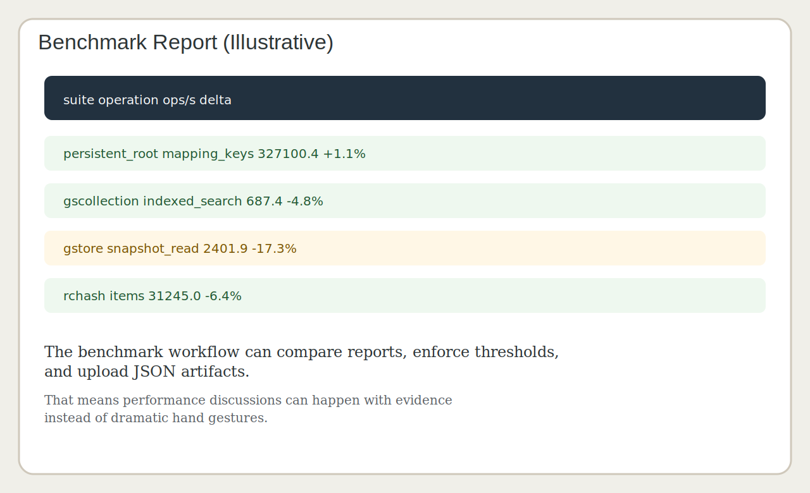

# Part IV: Queries, Stores, and Logs

## Opening Sentence

At some point every application graduates from "I have a persistent dictionary"
to "I need a shape for repeated lookup, history, or search."

That is when the specialist tools step onto the stage:

- `GSCollection`
- `GStore`
- `ObjectLog`

Each one solves a different problem. The trick is not merely knowing that they
exist. The trick is knowing when each one is the least surprising tool.

\newpage

## `GSCollection`: When Search Begins to Matter

`GSCollection` is for collections you want to query by stored attributes.

That makes it the natural next step after `PersistentRoot` when you discover
that "top-level key plus nested dict" is no longer enough.

It is good for:

- named logical collections
- indexed lookups
- search operations repeated often enough to deserve respect

It is not good for:

- replacing all dictionaries just because indexing sounds sophisticated
- pretending you now have an ORM universe and therefore wisdom

\newpage

## A Good Reason to Use `GSCollection`

You have records like:

```python
{"name": "Ada", "city": "London", "team": "Platform"}
```

And you need to do this repeatedly:

- find everyone in London
- find all records for a given team
- keep the collection named and reusable

That is `GSCollection` territory.

The package examples around indexing do a good job of teaching exactly this
moment, which is why they remain worth reading even if you already know the API.

\newpage

## Indexes Are a Promise to Your Future Self

Creating an index is not a performance charm or a badge. It is a promise:

> "We expect to look this up often enough that we care."

That promise helps in two ways.

First, it speeds the workload.

Second, it clarifies intent in the codebase. Somebody reading the collection
definition learns which queries the system actually values.

That is an underrated form of documentation. Good indexes explain the workload.

\newpage

## `GStore`: A Repository Store That Feels Like a Store

`GStore` exists because many programmers want a store-shaped interface even when
the underlying persistence is a GemStone repository.

This is a reasonable desire.

Sometimes the best application abstraction is:

- string-ish key
- structured value
- named store
- direct read/write semantics

That is exactly the space `GStore` occupies.

\newpage

## Why `GStore` Is Nice

It is easy to explain:

```python
store["sku:hat"] = {"name": "Hat", "stock": 8}
```

It is also honest.

The values are still persisted through GemStone, but the programming model is
store-oriented rather than collection-oriented.

That distinction is subtle and useful:

- `GSCollection` is about record collections and queries
- `GStore` is about named key/value persistence

Confusing the two makes APIs worse and conversations longer.

\newpage

## `ObjectLog`: When the Past Needs a Filing System

`ObjectLog` is for events that should live in the repository with the data they
describe.

This is not the same thing as standard Python logging.

Python logging answers:

> "What did the process say at runtime?"

`ObjectLog` answers:

> "What durable event record should remain attached to this system?"

That difference matters when audits, history, and postmortems become real.

\newpage

## The Psychological Value of a Good Log

Systems without durable event logs create a familiar species of meeting:

- several people are present
- nobody knows exactly what happened
- everyone uses verbs like "probably" and "maybe"
- one person says "I think it was after deploy"
- another says "which deploy"

An `ObjectLog` does not solve every mystery, but it improves the quality of your
ignorance. That is a large operational gift.

\newpage

## Screenshot Intermission: Benchmarks Are Not the Same as Examples



The package wisely separates examples from maintained benchmark tooling.

That separation is part of the same design discipline that makes the persistence
helpers useful. Teaching code is not measurement policy. Measurement policy is
measurement policy.

\newpage

## Choosing Between the Three

Use `PersistentRoot` when:

- you want named top-level state
- lookups are direct

Use `GSCollection` when:

- indexed search matters
- records behave like a queryable collection

Use `GStore` when:

- a key/value store model is the clearest fit

Use `ObjectLog` when:

- the history itself is a first-class output

The point is not to pick a winner. The point is to stop forcing one abstraction
to cosplay as all the others.

\newpage

## Performance Work Happened Here Too

These helpers are not just API wrappers. They have received real batching and
round-trip reduction work.

Why mention that in a user book?

Because the shape of the abstraction affects how much users trust it.

A helper that reads as though it respects the repository but then performs like
it resents the network is difficult to recommend with a straight face.

The package now has:

- batched mapping fetches
- benchmark reports
- comparison tooling
- environment-specific baselines

That makes the performance story concrete instead of ceremonial.

\newpage

## The Main Example Ties Them Together

The large `examples/example.py` script shows the specialist helpers not as
isolated toys but as neighbours in one coherent package:

- root for top-level names
- store for key/value persistence
- object log for events
- concurrency helpers for shared mutable state

This is important.

A library becomes easier to trust when the major pieces feel like they were
designed to live in the same house, rather than as distant cousins introduced at
a wedding.

\newpage

## A Joke About Naming Stores

If your `GStore` files are named:

- `db.db`
- `new.db`
- `test2.db`

then congratulations: you have re-created the personality of a temporary
directory inside a persistent system.

Name them like they are real.

Your benchmark reports, cleanup scripts, and future self will all appreciate it.

\newpage

## A Practical Design Heuristic

When in doubt, ask:

> "What question will I ask this data most often?"

If the answer is:

- "What is the top-level thing named X?" -> `PersistentRoot`
- "What value is stored at key Y?" -> `GStore`
- "Which rows match this attribute?" -> `GSCollection`
- "What happened over time?" -> `ObjectLog`

That question is often enough to choose correctly.

\newpage

## End of Part IV

You now have the package's major persistence helpers in view.

Next we move to the place where people become either very happy or very haunted:

the web layer.

Request lifecycles make transaction design visible in a way scripts rarely do.
That is why the next part exists.

\newpage

## Part IV Notes Page

- `GSCollection` is for indexed record-style lookup
- `GStore` is for key/value persistence
- `ObjectLog` is for durable event history
- do not force one abstraction to do all jobs badly
- the package backs the abstractions with real benchmark and batching work

If you remember only one line from this part, make it this one:

> Choose the helper by access pattern, not by mood.
