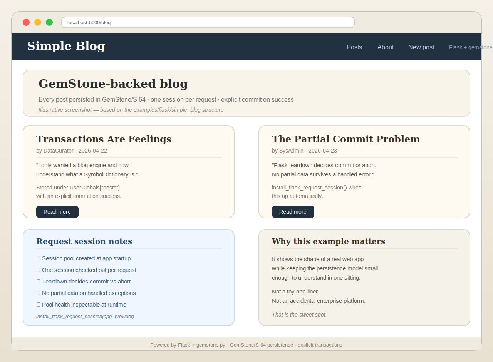

# Part V: Web Apps and Request Lifecycles

## Opening Confession

A persistence package can feel excellent in scripts and still behave terribly in
web applications.

Why?

Because request lifecycles are where hidden transaction assumptions go to become
user-visible incidents.

This part exists so you do not have to learn that lesson exclusively through
production embarrassment.

## The First Rule of Web Persistence

A request is not merely a function call with fashionable headers.

It is a unit of work with:

- inputs
- application logic
- error handling
- response generation
- and a final decision about whether repository changes should survive

That final decision is the heart of the matter.

If the persistence layer commits too early, you can easily wind up with:

- a failed request
- an unhappy user
- and a successful partial commit

That combination is offensively educational.

## What the Package Provides

`gemstone_py.web` gives you:

- `install_flask_request_session(...)`
- `GemStoneSessionPool`
- `GemStoneThreadLocalSessionProvider`
- `session_scope(...)`
- provider snapshots
- close hooks
- request lifecycle wiring

This is not a random utility pile. It is the package's answer to the question:

> "How should a Python web app use GemStone responsibly?"

## The Key Design Decision: Teardown Owns the Outcome

One of the most valuable hardening changes in the package was moving final
request persistence decisions into teardown rather than letting an earlier hook
pretend success had already been decided.

This matters for handled error paths.

If the app catches an exception, returns a `500`, and the persistence layer has
already committed, you have created the worst kind of bug:

- easy to trigger
- hard to explain
- and deeply annoying to users

The package now avoids that class of failure by design.

## A Screenshot of the Kind of App This Enables

You do not need a huge app to benefit from request-scoped session handling.

Even a small Flask application with:

- a few routes
- a persistent model
- and some forms

already benefits from predictable commit-or-abort semantics.

## Pools Versus Thread-Local Providers

You have two main provider styles.

### `GemStoneSessionPool`

Use this when:

- concurrency is real
- request workers are multiple
- you want bounded reuse and operational accounting

### `GemStoneThreadLocalSessionProvider`

Use this when:

- one session per thread is the clearest mapping
- the threading model is simple and stable

Do not choose based on whichever name sounds more advanced. Choose based on
actual runtime shape.

## Why Operational Visibility Matters

The provider layer has snapshots, health checks, counters, and lifecycle hooks
because web session reuse is not merely a programming abstraction. It is an
operational system.

That means somebody will eventually ask:

- how many sessions are in use?
- are they healthy?
- are they being recycled?
- did a request leak one?

If the package cannot answer those questions, the application will eventually
answer them by failing in public.

## The `simple_blog` Example

The `examples/flask/simple_blog/` app is valuable because it is modest.

That sounds strange, but modesty is an underrated teaching property.

The example is large enough to demonstrate:

- routes
- persistent state
- request integration

But small enough that a user can still keep the application shape in their head.

That makes it a much better first web example than a sprawling demo with seven
screens and an identity crisis.

## The `magtag` Example

Then there is `magtag`, which is the package saying:

> "Fine. You want a larger app. Here is a larger app."

It demonstrates:

- more routes
- more state
- collection-backed behaviour
- more realistic interaction flow

It is useful not because you will copy it verbatim, but because it proves the
package can live inside a web application with enough surface area to trigger
real integration concerns.

## Session Middleware Is a Moral Choice

When a web package decides where and how persistence happens during requests, it
is making a moral choice about who gets surprised later.

Good middleware surprises fewer people.

Bad middleware says:

- "I committed already"
- "I assumed the response meant success"
- "I hope your error path was decorative"

The current `gemstone-py` web design is good specifically because it stopped
doing that.

## Production Guidance, Short Version

If you are using Flask:

1. install request-session handling explicitly
2. prefer a pool unless you have a clear reason not to
3. keep request logic inside the request/session lifecycle
4. let teardown decide final commit vs abort
5. expose provider snapshot or health data in admin or ops endpoints

This is not over-engineering. It is the difference between a system you can
debug and a system you can narrate only in retrospect.

## The "Handled 500" Story

One of the package's own live workflow failures helped prove the value of the
current design.

A handled `500` path exposed that earlier lifecycle logic could still commit
work before teardown had the chance to abort it properly.

That failure was useful because:

- it happened in a real workflow
- it had a concrete symptom
- it led to a better design

The right lesson is not "how embarrassing." The right lesson is "good packages
allow their own verification lanes to teach them something important."

## Web Development Is Where Discipline Pays Off

In scripts, sloppy transaction semantics may sleep quietly for a while.

In web apps:

- users race each other
- handlers fail halfway through
- retries happen
- timeouts happen
- pool state matters

This is why the package's investment in session providers, live tests, soak
tests, and request teardown logic is not optional garnish. It is the core of
trustworthy web use.

## A Joke About Flask Extensions

Many Flask extensions silently assume they are the only adults in the room.

`gemstone-py` has taken the opposite attitude:

> "The request lifecycle is shared property, so our transaction story had better
> be explicit and testable."

That is less romantic than black-box convenience, but much better if you enjoy
applications that can survive contact with errors.

## End of Part V

Web integration is where the package proves it is not only a scripting bridge.

Next comes the part that frightens everybody just enough to be useful:

concurrency, conflicts, shared state, retries, and the rules for not becoming a
folktale told by more careful engineers.

## Part V Notes Page

- request lifecycles are real transaction boundaries
- teardown should own final commit vs abort
- pools are generally the safer production default
- thread-local providers are good for simpler hosting models
- live and soak tests matter here because theory is not enough

If you remember only one line from this part, make it this one:

> A failed request must not quietly become a successful commit.
