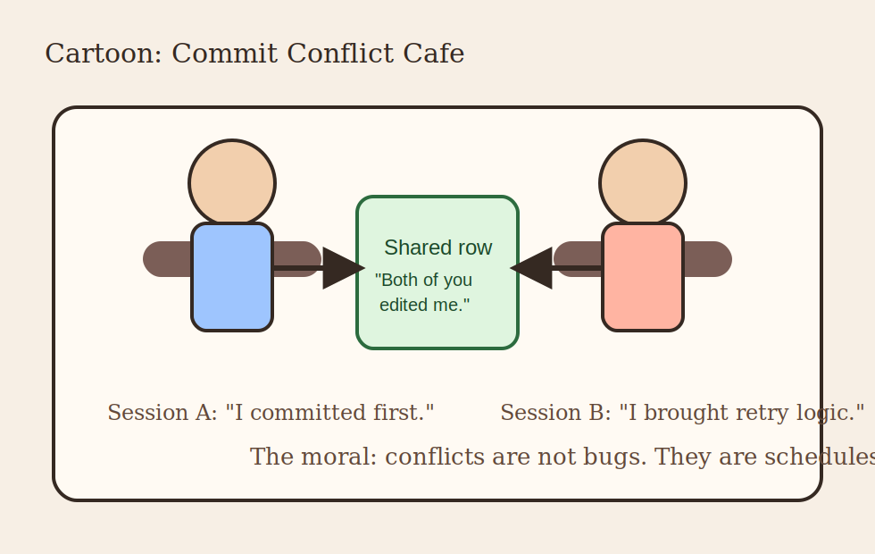

# Part VI: Concurrency, Conflicts, and Retries

## Opening Warning

This part is where the package stops smiling politely and starts asking whether
you actually mean what you say about shared state.

GemStone is not embarrassed by concurrency. It assumes you will need it.

The package therefore gives you real shared primitives, conflict visibility, and
retry patterns. It does not promise a universe where everyone edits the same row
and friendship magically wins.

\newpage

## Shared State Is the Point, Not an Accident

The concurrency helpers exist because some state really does belong in the
repository rather than in one Python worker process.

That includes:

- counters
- queues
- shared hashes

When those structures matter across sessions, pretending they are local Python
objects with a distant data layer is a design mistake. The package chooses to be
honest instead.

\newpage

## The Core Helpers

The main actors are:

- `RCCounter`
- `RCHash`
- `RCQueue`

They are useful because they let multiple sessions coordinate through repository
backed primitives.

They are dangerous because they let multiple sessions coordinate through
repository backed primitives.

Those are the same sentence wearing different shoes.

\newpage

## `RCCounter`

Use `RCCounter` when the number must be shared and durable.

Examples:

- sequence generation
- shared progress counters
- coordination statistics

Do not use it when:

- a Python integer in one process would do
- the count is temporary and local
- you simply enjoy the phrase "repository-backed counter"

Taste matters.

\newpage

## `RCHash`

`RCHash` is the package's shared hash structure. It became especially
interesting after batching improvements reduced the amount of chatter required to
read its contents.

This is a useful reminder that concurrency helpers are not merely conceptual
objects. They also need to perform.

A shared data structure that is correct but painfully chatty becomes a tax on
every user. The package has put real work into making the hot paths more sane.

\newpage

## `RCQueue`

Queues are where concurrency suddenly stops being academic.

A queue immediately invites questions like:

- who adds work?
- who consumes work?
- what happens if two consumers try?
- how do we recover after partial processing?

These are good questions. They are the questions that make real systems
interesting and occasionally noisy.

\newpage

## Commit Conflicts Are Not Personal Attacks

Let us say this clearly:

`CommitConflictError` is not a moral judgment.

It means:

- two sessions touched overlapping state
- one of them committed first
- the other must retry, abort, or restructure its unit of work

That is all.

Treating conflicts as shocking betrayals is like treating a traffic light as a
personal insult. The system is only telling you that other actors exist.

\newpage

## Cafe Intermission

This is the whole concept in one image:

- two sessions
- one shared row
- one clean explanation for why only one of them gets to pretend it was first

The joke works because the underlying logic is exact.

\newpage

## Retry Logic Is Part of Design

Once a system has true multi-session writes, retries stop being an advanced
technique and become part of normal design.

The right retry shape is:

- small unit of work
- explicit conflict boundary
- limited retry scope
- clear logging or visibility

The wrong retry shape is:

- "catch everything"
- rerun half the application
- hope the world has changed enough to make this count as architecture

\newpage

## Locks Are Tools, Not Decorations

The package also exposes lock-related behaviour and instance inspection paths.

Locks are useful when:

- coordination needs stronger guarantees
- shared access patterns are explicit
- contention must be managed rather than merely observed

They are not useful when added as ceremonial hardware to make a design sound
serious in conversation.

Use them because the access pattern requires them, not because "enterprise"
started whispering in your ear.

\newpage

## The Live Tests Matter Here More Than Almost Anywhere

Unit tests can teach API behaviour, but concurrency becomes genuinely credible
only when live tests exercise:

- multiple sessions
- real conflicts
- real retry loops
- real pool and provider reuse
- lock-heavy paths

The package now includes repeated live contention and soak coverage because this
domain refuses to be adequately explained by clever mocking alone.

\newpage

## Why Soak Tests Exist

A short contention test proves basic correctness.

A soak test is trying to answer a harder question:

> "Does this continue to behave under repeated reuse, pressure, and state
> recycling?"

That is exactly the kind of question that matters in long-running applications.

It is also exactly the kind of question that tends to go unasked until a system
is old enough to have opinions and young enough to still page you.

\newpage

## Naming Shared Structures

If a queue, hash, or counter lives at the top level, name it like it will be
inspected during an incident.

Good:

- `InboundInvoiceQueue`
- `ImportRetryCounter`
- `SessionCoordinationHash`

Bad:

- `TmpQueue`
- `Counter2`
- `MysteryHash`

The repository is not merely where data lives. It is where future explanations
must begin.

\newpage

## A Practical Conflict Strategy

If you expect conflicts:

1. isolate the shared state
2. reduce the transaction surface
3. log enough context to understand retries
4. keep the retry block narrow
5. accept that some paths must abort cleanly

This is how you keep concurrency from becoming a superstition.

\newpage

## The Secret Benefit of Good Conflict Handling

Good conflict handling makes teams calmer.

Why?

Because the system stops behaving like a haunted house. A conflict becomes:

- visible
- reproducible
- retryable
- documentable

That is much easier to live with than a system that "sometimes loses updates"
and therefore forces everyone into dramatic oral history.

\newpage

## End of Part VI

You have now seen the package at its most honest:

- shared state
- conflicts
- retries
- soak behaviour

That leaves one final territory:

the boring, glorious machinery that proves a package can survive real life:

- benchmarks
- release workflows
- runners
- PyPI
- post-release verification

\newpage

## Part VI Notes Page

- shared state is real state
- conflicts are expected, not scandalous
- retries should be narrow and deliberate
- locks exist to solve patterns, not to impress people
- live contention and soak tests matter because concurrency lies in small demos

If you remember only one line from this part, make it this one:

> A conflict is a scheduling fact, not a character assessment.
