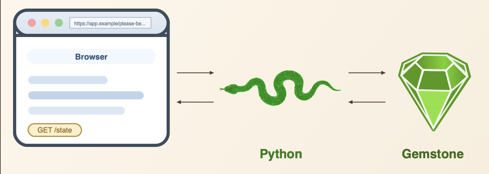

# Talking to GemStone/S from Python — A Complete Guide to gemstone-py



*GemStone/S is one of the most capable object databases ever built. This article shows you how to drive it from Python — no Smalltalk IDE required.*

---

## What is GemStone/S?

GemStone/S 64 is an industrial-strength Smalltalk object database that has been running financial systems, healthcare platforms, and telecom backends since the 1980s. It stores live objects — not rows, not documents — and you query them by sending them Smalltalk messages. Its concurrency model uses reduced-conflict data structures and multi-version concurrency control, so hundreds of sessions can write simultaneously without blocking each other.

Until recently, if you wanted to talk to GemStone from Python you were out of luck. **gemstone-py** closes that gap.

---

## Architecture at a Glance

```
Your Python code
      │
      ▼
  gemstone-py          ← Python package (pip install gemstone-py)
      │
      ▼
  GCI C library        ← libgcirpc-3.7.5-64.so / .dylib (ships with GemStone)
      │
      ▼
  GemStone Stone       ← the database server (local or remote)
```

The GemStone Client Interface (GCI) is a C shared library that ships with every GemStone installation. gemstone-py loads it at runtime via `ctypes`, binds the relevant functions, and exposes them through a clean Python API. No middleware, no TCP proxy, no message bus — you call GCI directly.

---

## Installation

```bash
pip install gemstone-py
```

For the optional PyO3 native fast path:

```bash
pip install "gemstone-py[fast]"
python -c "from gemstone_py import _gci; print(_gci.IMPLEMENTATION)"
```

The default backend is the pure `ctypes` GCI binding. The native package is
selected automatically when it is installed. Set `GEMSTONE_PY_GCI_BACKEND` to
`ctypes` or `native` before Python starts when you want an explicit comparison.
The repository checkout also includes `examples/native_backend/check_backend.py`
for a fuller backend report.

**Prerequisites:**

- GemStone/S 64 3.x installed locally or accessible over the network
- The GCI shared library on your dynamic linker path:

```bash
# macOS
export GEMSTONE=/opt/gemstone/GemStone64Bit3.7.5-arm64.Darwin
export DYLD_LIBRARY_PATH=$GEMSTONE/lib:$DYLD_LIBRARY_PATH

# Linux
export LD_LIBRARY_PATH=$GEMSTONE/lib:$LD_LIBRARY_PATH
```

---

## Opening a Session

`GemStoneSession` is the core object. Use it as a context manager and it handles login, transaction policy, and logout automatically.

```python
import gemstone_py as gemstone

with gemstone.GemStoneSession(
    stone="gs64stone",
    username="DataCurator",
    password="swordfish",
    transaction_policy=gemstone.TransactionPolicy.COMMIT_ON_SUCCESS,
) as session:
    result = session.eval("3 + 4")
    print(result)  # 7
```

Or load credentials from environment variables:

```bash
export GS_STONE=gs64stone
export GS_STONE_NAME=gs64stone
export GS_USERNAME=DataCurator
export GS_PASSWORD=swordfish
```

`GS_STONE` is the canonical stone variable. `GS_STONE_NAME` is accepted as an
alias when `GS_STONE` is absent, so setting both to the same value keeps shell
usage, VS Code settings, and helper tools consistent.

```python
config = gemstone.GemStoneConfig.from_env()

with gemstone.GemStoneSession(config=config) as session:
    version = session.eval("System version")
    print(version)  # 'GemStone/S 64 Bit 3.7.5 ...'
```

For a fresh or shared stone, you can audit and initialize the GemStone-side
roots used by the higher-level helpers:

```bash
gemstone-bootstrap --status
gemstone-bootstrap
```

The bootstrap is idempotent. It creates missing `UserGlobals` entries for
`GStoreRoot`, `GSQueryRoot`, and `GemstonePyBootstrapVersion`, and it leaves
existing roots untouched.

For remote stones:

```python
with gemstone.GemStoneSession(
    host="db.example.com",
    netldi="netldi",
    stone="gs64stone",
    username="DataCurator",
    password="swordfish",
) as session:
    ...
```

---

## Transaction Policies

Every GemStone session runs inside a transaction. gemstone-py gives you three policies:

| Policy | Behaviour |
|---|---|
| `MANUAL` | You call `session.commit()` or `session.abort()` yourself |
| `COMMIT_ON_SUCCESS` | Commits automatically on clean `__exit__` |
| `ABORT_ON_EXIT` | Aborts on exit regardless (useful for read-only work) |

```python
# Read-only session — always abort on exit, never leave dangling transactions
with gemstone.GemStoneSession(
    config=config,
    transaction_policy=gemstone.TransactionPolicy.ABORT_ON_EXIT,
) as session:
    count = session.eval("UserGlobals size")
    print(count)

# Write session — commit on clean exit, abort on exception
with gemstone.GemStoneSession(
    config=config,
    transaction_policy=gemstone.TransactionPolicy.COMMIT_ON_SUCCESS,
) as session:
    session.eval("UserGlobals at: #Counter put: 1")
```

---

## Evaluating Smalltalk

`session.eval()` evaluates any Smalltalk expression and marshals the result back to Python automatically. The core session marshaller is intentionally small: scalar values become native Python values, and live GemStone objects become `OopRef` handles. Higher-level APIs such as `PersistentRoot`, `GsDict`, and the collection wrappers use a richer read path when they fetch object references from GemStone.

| GemStone value or class | `session.eval()` / `perform_value()` result | `PersistentRoot` / wrapper read result | Python value accepted on write |
|---|---|---|---|
| `nil` | `None` | `None` | `None` |
| `Boolean` (`true`, `false`) | `bool` | `bool` | `bool` |
| `SmallInteger` | `int` | `int` | `int` (stored as a SmallInteger OOP) |
| `LargeInteger` | `OopRef` | `GsObject` | Not automatic |
| `SmallDouble` / `Float` | `float` when GCI can decode it | `float` when GCI can decode it | `float` |
| `Fraction` / `ScaledDecimal` / `DecimalFloat` | `OopRef` | `GsObject` | Not automatic |
| `String` | `str` | `str` | `str` (stored as `String`) |
| `Symbol` | `str` | `str` | Use `session.new_symbol()` when you need a `Symbol`; plain `str` writes a `String` |
| `Character` | Single-character `str` | Single-character `str` | Not automatic |
| `StringKeyValueDictionary` | `OopRef` | `GsDict` | `dict` or `GsDict` |
| `Array` | `OopRef` | `list` with recursively converted items | `list` or `tuple` |
| `OrderedCollection` | `OopRef` | `OrderedCollection` | Existing wrapper object |
| `RcCounter` | `OopRef` | `RCCounter` | Existing wrapper object |
| `RcKeyValueDictionary` | `OopRef` | `RCHash` | Existing wrapper object |
| `RcQueue` | `OopRef` | `RCQueue` | Existing wrapper object |
| `Date` / `Time` / `DateTime` / `DateAndTime` | `OopRef` | `GsObject` | Not automatic; use `gs_datetime()` / `datetime_to_gs()` for `DateAndTime` |
| `Dictionary` / `IdentityDictionary` / `Set` / other collections without a dedicated wrapper | `OopRef` | `GsObject` | Not automatic |
| Any other GemStone object | `OopRef` | `GsObject` | Not automatic, unless you pass an existing Python wrapper that exposes `_oop` |

This table is about automatic conversion. If a value comes back as `OopRef` or `GsObject`, you can still work with it by sending Smalltalk messages through `send()`, `perform_value()`, or `perform_oop()`.

```python
session.eval("'Hello' , ' world'")   # 'Hello world'
session.eval("42 factorial")          # 1405006117752879898543142606244...
session.eval("Date today")            # <OopRef 0x000000000002B001>
session.eval("#(1 2 3) size")         # 3
session.eval("nil")                   # None
```

If you need the raw OOP integer rather than a marshalled Python value, use `eval_oop()`:

```python
oop = session.eval_oop("OrderedCollection new")
print(hex(oop))  # 0x000000004A3C0001
```

---

## Sending Messages to Objects

Once you have an OOP (either from `eval_oop` or an `OopRef`), you can send Smalltalk messages to it:

```python
coll_oop = session.eval_oop("OrderedCollection new")

# perform_value() marshals the result
session.perform_value(coll_oop, "add:", session.int_oop(42))
size = session.perform_value(coll_oop, "size")
print(size)  # 1

# perform() and perform_oop() keep the result as an integer OOP
item_oop = session.perform_oop(coll_oop, "first")
print(session.perform_value(item_oop, "printString"))  # '42'
```

`OopRef` objects have a convenience `.send()` method:

```python
ref = session.eval("OrderedCollection new")  # returns OopRef
ref.send("add:", session.int_oop(99))
print(ref.print_string())  # 'OrderedCollection (99 )'
```

For long-lived raw OOPs, prefer managed or scoped handles. They retain the OOP
in the GemStone export set while Python is still using it:

```python
collection = session.execute_managed("OrderedCollection new")
collection.send("add:", session.new_string("managed"))
print(collection.print_string())
collection.close()

raw_oop = session.execute_oop("OrderedCollection new")
with session.handle(raw_oop) as handle:
    print(handle.send("printString"))
```

Typed OOPs add a static type witness without changing the raw OOP model:

```python
from typing import Protocol
from gemstone_py import gemstone_class

@gemstone_class("Date")
class GemStoneDate(Protocol):
    @property
    def printString(self) -> str: ...

today = session.execute_typed("Date today", GemStoneDate)
print(today.proxy().printString)
```

---

## Persistent Storage with PersistentRoot

`PersistentRoot` wraps a GemStone SymbolDictionary as a dict-like object. Every write goes straight to GemStone via GCI — no eval-string construction, no injection risk.

```python
from gemstone_py.persistent_root import PersistentRoot

with gemstone.GemStoneSession(config=config) as session:
    root = PersistentRoot(session)  # wraps UserGlobals

    # Store a nested structure
    root["MyApp"] = {
        "version": "1.0",
        "settings": {
            "debug": False,
            "max_retries": 3,
        },
        "tags": ["production", "v1"],
    }

    session.commit()

# Read it back in a later session
with gemstone.GemStoneSession(config=config) as session:
    root = PersistentRoot(session)
    app = root["MyApp"]        # GsDict proxy
    print(app["version"])      # '1.0'
    print(dict(app["settings"]))  # {'debug': False, 'max_retries': 3}
```

The four built-in SymbolDictionaries:

```python
root     = PersistentRoot(session)            # UserGlobals — your data
globals_ = PersistentRoot.globals(session)    # Globals — system classes
pub      = PersistentRoot.published(session)  # Published — shared objects
sm       = PersistentRoot.session_methods(session)  # SessionMethods — transient
```

---

## GStore: A Simple Key/Value Store

`GStore` wraps UserGlobals as a namespaced key/value store. Values are JSON-serialised automatically, and commit conflicts are retried up to 10 times.

```python
from gemstone_py.gstore import GStore

db = GStore("myapp.db")

with db.transaction() as t:
    t["user:tariq"] = {"name": "Tariq", "score": 100}
    t["counter"] = t.get("counter", 0) + 1

with db.transaction(read_only=True) as t:
    print(t["user:tariq"])     # {'name': 'Tariq', 'score': 100}
    print(t["counter"])        # 1

# To abort without committing:
from gemstone_py.gstore import GStoreAbortTransaction

with db.transaction() as t:
    t["draft"] = "in progress"
    raise GStoreAbortTransaction   # nothing committed
```

---

## Typed Collection Queries

`GSCollection` supports the classic string predicate style and a typed query
style that records attribute access as GemStone ivar paths:

```python
from typing import Protocol
from gemstone_py.gsquery import GSCollection

class BlogPostRecord(Protocol):
    title: str
    status: str

posts = GSCollection("SimplePosts", config=config).query(BlogPostRecord)
published = posts.where(lambda post: post.status == "published").all()

for post in published:
    print(post.title)
```

The lambda is a query expression builder. `post.status` becomes `@status`; the
filter still runs through GemStone's collection/index path.

---

## Async and FastAPI

GCI remains synchronous and session-owned. The async API wraps a synchronous
session in a one-worker executor so the event loop does not block:

```python
from gemstone_py.aio import AsyncSession

async with AsyncSession.connect(config=config) as session:
    async with session.transaction():
        root = session.root()
        await root.set("AsyncArticleExample", {"status": "ok"})
```

FastAPI uses that async session surface:

```python
from fastapi import Depends, FastAPI
from gemstone_py.aio import AsyncSession
from gemstone_py.aio.fastapi import session_dependency

app = FastAPI()
get_gemstone = session_dependency(config=config)

@app.get("/health/gemstone")
async def gemstone_health(session: AsyncSession = Depends(get_gemstone)):
    return {"result": await session.eval("3 + 4")}
```

Runnable examples live in `examples/async_features/` and `examples/fastapi/`.

---

## Concurrency Primitives

GemStone's reduced-conflict data structures let multiple sessions write without conflicting with each other. gemstone-py exposes them directly:

```python
from gemstone_py.concurrency import RCCounter, RCHash, RCQueue
from gemstone_py.persistent_root import PersistentRoot

with gemstone.GemStoneSession(config=config) as session:
    root = PersistentRoot(session)

    # RCCounter — safe to increment from hundreds of concurrent sessions
    root["hits"] = RCCounter(session)
    root["hits"].increment()
    root["hits"].increment(5)
    print(root["hits"].value)   # 6

    # RCHash — concurrent writes to different keys never conflict
    root["cache"] = RCHash(session)
    root["cache"]["session:42"] = "user data"

    # RCQueue — many producers, one consumer
    root["jobs"] = RCQueue(session)
    root["jobs"].push("task-1")
    root["jobs"].push("task-2")
    job = root["jobs"].pop()    # 'task-1'

    session.commit()
```

### Object Locking

```python
from gemstone_py.concurrency import lock, read_lock, unlock

with gemstone.GemStoneSession(config=config) as session:
    root = PersistentRoot(session)
    obj_oop = session.eval_oop("UserGlobals at: #MyObject")

    lock(session, obj_oop)         # exclusive write lock
    # ... mutate the object ...
    session.commit()               # lock released automatically on commit
```

---

## Flask Integration

For web applications, gemstone-py provides a session pool that lends one GemStone session per HTTP request and returns it to the pool on teardown.

```python
from flask import Flask
import gemstone_py as gemstone

app = Flask(__name__)

# Install the pool at startup — warm it with 2 sessions
gemstone.install_flask_request_session(
    app,
    config=gemstone.GemStoneConfig.from_env(),
    maxsize=10,
)
gemstone.warm_flask_request_session_provider(app, count=2)

@app.route("/count")
def count():
    session = gemstone.current_flask_request_session()
    n = session.eval("UserGlobals at: #Counter ifAbsent: [0]")
    return {"count": n}
```

The pool tracks metrics you can expose as a health endpoint:

```python
@app.route("/healthz")
def health():
    snap = gemstone.flask_request_session_provider_snapshot(app)
    return {
        "available": snap.available,
        "in_use": snap.in_use,
        "created": snap.created,
    }
```

---

## Batched GCI Evaluation

The most important performance pattern in gemstone-py is **batching**: instead of making one GCI call per field, write a single Smalltalk script that serialises everything you need as a delimited string and decode it in Python. This turns ~80 round-trips into 1.

```python
script = """
| result |
result := String new.
UserGlobals keysAndValuesDo: [:k :v |
    result := result , k printString , '|' , v printString , String nl.
].
result
"""
raw = session.eval(script)
for line in raw.strip().splitlines():
    key, _, value = line.partition("|")
    print(key, "→", value)
```

The `_smalltalk_batch` module provides helpers (`escaped_field_encoder_source`, `decode_escaped_field`) for building robust pipe-delimited serialisers that handle special characters in object printStrings.

---

## Diagram: Session Lifecycle

```
  Python                          GemStone Stone
  ──────                          ──────────────

  GemStoneSession.__enter__()
    │
    ├─── GciInit()              ─────────────────►  load GCI library
    ├─── GciSetNet(stone, ...)  ─────────────────►  set network target
    ├─── GciLoginEx(user, pw)   ─────────────────►  open session
    │                           ◄─────────────────  session ID
    │
    │   [your code runs here]
    │
    ├─── GciExecuteStr(source)  ─────────────────►  eval Smalltalk
    │                           ◄─────────────────  result OOP
    │
    ├─── GciCommit()            ─────────────────►  commit transaction
    │
    └─── GciLogout()            ─────────────────►  close session
```

---

## GemStone Database Explorer

Once you can talk to GemStone from Python, what can you build? Here is a practical example: a web-based object browser.

**GemStone Database Explorer** (`python-gemstone-database-explorer`) is a Flask application that lets you inspect any object in a live GemStone database from a browser — no Pharo, no VisualWorks, no Smalltalk IDE required.

```
Browser  ──HTTP──►  Flask (gemstone_p/app.py)
                        │
                        ▼
                   object_view.py   ← batched Smalltalk eval
                        │
                        ▼
                   session.py       ← per-request login/logout
                        │
                        ▼
                   gemstone-py      ← GCI C library bridge
                        │
                        ▼
                   GemStone Stone
```

### Features

- **Object Browser** — navigate the full object graph starting from UserGlobals, Globals, or the System object. Inspect instance variables, dictionary entries, and collection elements. Evaluate arbitrary Smalltalk in the context of any object.
- **Symbol List Browser** — browse all symbol lists by user and dictionary. View key/value pairs and printStrings. Add and remove dictionaries and entries from the browser.
- **Transaction control** — Commit and Abort buttons on both tabs.
- **Fast** — uses batched GCI evaluation: a single `session.eval()` call returns all fields for an object view, keeping the UI snappy even over a network connection.

### Explorer Installation

```bash
git clone https://github.com/unicompute/python-gemstone-database-explorer
cd python-gemstone-database-explorer
python3 -m venv .venv
.venv/bin/pip install -e .
```

### Configuration

```bash
export GEMSTONE=/opt/gemstone/GemStone64Bit3.7.5-arm64.Darwin
export DYLD_LIBRARY_PATH=$GEMSTONE/lib:$DYLD_LIBRARY_PATH
export GS_USERNAME=DataCurator
export GS_PASSWORD=swordfish
export GEMSTONE_NRS='!tcp@localhost#server!gemstone'
```

### Running

```bash
.venv/bin/python-gemstone-database-explorer
# → GemStone Database Explorer running at http://127.0.0.1:9292/
```

Open `http://127.0.0.1:9292/` in a browser.

### Object Browser

The Object Browser tab lets you navigate the object graph. Click any object to inspect its instance variables, keys, or elements. Breadcrumbs track your path back through the graph.

*Object Browser: navigate the live object graph, inspect instance variables, and evaluate Smalltalk in context.*

The eval panel lets you run Smalltalk expressions in the context of the currently selected object:

```
self size           → 42
self keys first     → 'MyApp'
self at: #MyApp     → a StringKeyValueDictionary
```

### Symbol List Browser

The Symbol List Browser tab shows the full symbol list for any GemStone user.

*Symbol List Browser: two-column layout — dictionaries on the left, keys and values on the right.*

The two-column layout mirrors the Pharo symbol list browser:
- Left column: dictionaries in the selected user's symbol list
- Right column: all keys in the selected dictionary
- Keys/Values table: key + value printString for the selected entry
- PrintString box: full printString of the selected value

### The batched eval trick

The key to the explorer's speed is that it fetches an entire object view in a single GCI round-trip. Here is the pattern for a hash/dictionary object:

```smalltalk
| d result count |
d := UserGlobals at: #MyDict.
count := d size.
result := count printString.
d keysAndValuesDo: [:k :v |
    result := result , String nl
        , (encoder value: k printString)
        , '|'
        , (encoder value: v class name)
        , '|'
        , (encoder value: v printString)
        , '|'
        , v basicOop printString.
].
result
```

The first line of the response is the entry count; each subsequent line is a pipe-delimited record. Python splits on newlines and pipes — no per-field round-trip needed.

---

## Visual Studio Code Workbench

If you prefer to stay inside Visual Studio Code, **gemstone-py Workbench** adds a
small GemStone Py sidebar for the Python-facing workflow. It is not meant to
replace Jasper, which remains the right tool for full GemStone/S Smalltalk IDE
work such as browsers, inspectors, debuggers, SUnit, and server management.

Install it from the Visual Studio Marketplace:

```bash
code --install-extension unicompute.gemstone-py-workbench
```

Marketplace page:
https://marketplace.visualstudio.com/items?itemName=unicompute.gemstone-py-workbench

The extension gives you one-click commands for the things you usually do while
learning or maintaining `gemstone-py`:

- run the maintained example modules from `examples/`
- check the active `ctypes` or native PyO3 GCI backend
- inspect the configured `GS_*` environment
- open the setup guide, user manual, examples guide, Medium article, and PDFs
- rebuild the documentation PDFs
- run CI, live checks, benchmarks, and native checks explicitly
- launch a configured `python-gemstone-database-explorer` checkout
- embed the running database explorer in a VS Code webview
- verify the workbench setup and copy the resulting report or export script
- open Jasper when you need Smalltalk IDE tooling

By default, the extension treats the current VS Code workspace as the
`gemstone-py` checkout. If you want it to launch the browser-based database
explorer, set `gemstonePy.explorerPath` to a local
`python-gemstone-database-explorer` checkout. Set `gemstonePy.env` with the
same `GS_STONE` or `GS_STONE_NAME`, `GS_USERNAME`, `GS_PASSWORD`, `GS_LIB`, and
library-path values you would use at the shell.

That makes VS Code a convenient Python control panel: use the workbench for
examples, docs, backend checks, and test commands; use the database explorer for
browser-based object inspection; and use Jasper when you need a full Smalltalk
IDE.

---

## The Full Picture

Here is everything gemstone-py gives you in one diagram:

```
gemstone-py
├── GemStoneSession          core session, eval, perform, commit/abort
├── GemStoneConfig           connection settings + from_env()
├── TransactionPolicy        MANUAL | COMMIT_ON_SUCCESS | ABORT_ON_EXIT
├── OopRef                   wraps a GemStone OOP; .send(), .print_string()
├── TypedOop / ManagedOop    typed OOPs and export-set lifetime handles
├── aio                      AsyncSession, AsyncPersistentRoot, AsyncGSCollection
├── native                   optional PyO3 backend discovery
│
├── persistent_root
│   ├── PersistentRoot       dict-like wrapper for a SymbolDictionary
│   ├── GsDict               proxy for StringKeyValueDictionary
│   └── GsObject             generic GemStone object proxy
│
├── gstore
│   └── GStore               namespaced key/value store, JSON-serialised
│
├── concurrency
│   ├── RCCounter            reduced-conflict counter
│   ├── RCHash               reduced-conflict key/value store
│   ├── RCQueue              reduced-conflict FIFO queue
│   ├── nested_transaction() context manager
│   ├── lock() / read_lock() object locking
│   └── gs_now() / gs_datetime() / datetime_to_gs()
│
├── web
│   ├── GemStoneSessionPool          pool of reusable sessions
│   ├── install_flask_request_session  Flask integration
│   └── current_flask_request_session  get the session for this request
├── aio.fastapi              FastAPI dependency and middleware helpers
│
└── benchmarks               benchmark CLIs + GitHub workflow tooling
```

---

## Links

- **gemstone-py** — https://github.com/unicompute/gemstone-py
- **GemStone Database Explorer** — https://github.com/unicompute/python-gemstone-database-explorer
- **gemstone-py Workbench for VS Code** — https://marketplace.visualstudio.com/items?itemName=unicompute.gemstone-py-workbench
- **Jasper** — https://github.com/jgfoster/Jasper
- **PyPI** — https://pypi.org/project/gemstone-py/
- **GemStone/S** — https://gemtalksystems.com/products/gs64/

---

*gemstone-py is open source under the MIT license. Contributions, bug reports, and feedback welcome.*
