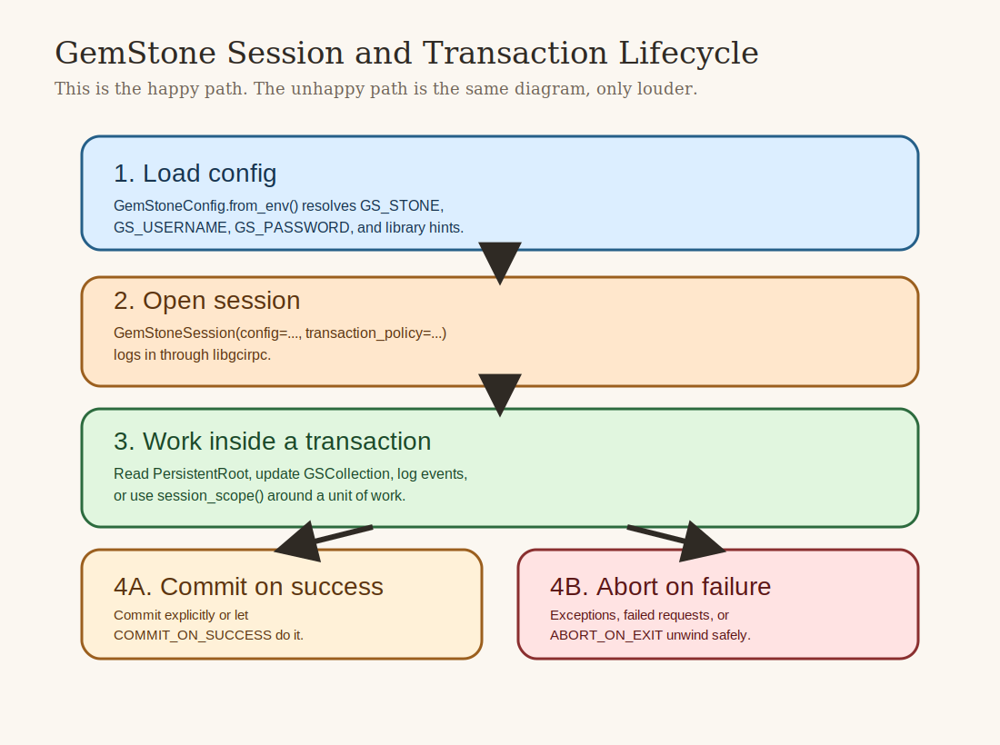

# Setup Guide

This guide gets you from "I cloned the repo" to "I can log in to GemStone from
Python and run the examples without muttering at the terminal."



## What You Need

At minimum:

- Python 3.10 or newer
- access to a GemStone/S 64 stone
- the GemStone client library (`libgcirpc`)
- a username and password that can log into the stone

For the full local development experience, you will also want:

- the repository checkout
- a working virtual environment
- the ability to run live tests against your stone
- if you use the self-hosted workflows, a GitHub Actions runner on the GemStone host

## Install the Package

From PyPI:

```bash
python3 -m pip install gemstone-py
```

From a repo checkout:

```bash
python3 -m venv .venv
source .venv/bin/activate
python -m pip install -U pip
python -m pip install -e .[dev]
```

## Required Environment Variables

The package expects its runtime configuration from environment variables. The
minimum set for most local work is:

```bash
export GS_LIB=/opt/gemstone/product/lib
export GS_STONE=gs64stone
export GS_USERNAME=DataCurator
export GS_PASSWORD=swordfish
```

Common optional variables:

```bash
export GS_HOST=localhost
export GS_NETLDI=netldi
export GS_GEM_SERVICE=gemnetobject
export GS_HOST_USERNAME=
export GS_HOST_PASSWORD=
export GS_LIB_PATH=/full/path/to/libgcirpc-3.7.x-64.dylib
```

What they mean:

- `GS_LIB`
  The GemStone `lib/` directory. The package uses it for library discovery.
- `GS_LIB_PATH`
  Optional exact path to a specific `libgcirpc` file. Use this when you want to
  pin the client library instead of relying on directory search.
- `GS_STONE`
  The stone name.
- `GS_USERNAME`, `GS_PASSWORD`
  The GemStone login credentials.
- `GS_HOST`, `GS_NETLDI`, `GS_GEM_SERVICE`
  Connection hints for remote or explicitly configured environments.
- `GS_HOST_USERNAME`, `GS_HOST_PASSWORD`
  Optional remote host credentials for cases where the underlying runtime needs them.

## First Real Login

The simplest sanity check is a tiny Python script:

```python
from gemstone_py import GemStoneConfig, GemStoneSession

config = GemStoneConfig.from_env()

with GemStoneSession(config=config) as session:
    print(session.eval("1 + 2"))
```

If that prints `3`, the package can:

- read your configuration
- load `libgcirpc`
- log in to GemStone
- evaluate Smalltalk in the repository

That is enough to start.

## Recommended First Commands

The package ships with a few small CLI helpers:

```bash
gemstone-hello
gemstone-smalltalk-demo
gemstone-examples hello
gemstone-examples smalltalk-demo
gemstone-benchmarks --help
```

What they are good for:

- `gemstone-hello`
  Tiny smoke check for the installed package.
- `gemstone-smalltalk-demo`
  Basic bridge demo that is easy to reason about.
- `gemstone-examples ...`
  A stable wrapper for the example entry points.
- `gemstone-benchmarks`
  The maintained benchmark lane, distinct from the teaching examples.

## Transaction Policy: Read This Early

The most important behavioural rule in `gemstone-py` is that transaction intent
should be explicit.

`GemStoneSession(...)` defaults to manual transaction control.

That means:

- a plain session does not silently commit just because your `with` block ended
- write scripts must call `commit()` explicitly or use a scoped helper that commits on success
- read-only scripts should usually abort or use an abort-on-exit policy

The common options are:

```python
from gemstone_py import GemStoneSession, TransactionPolicy

with GemStoneSession(
    config=config,
    transaction_policy=TransactionPolicy.COMMIT_ON_SUCCESS,
) as session:
    ...
```

Or:

```python
from gemstone_py import session_scope

with session_scope(config=config) as session:
    ...
```

Use this rule of thumb:

- one-off write script -> `COMMIT_ON_SUCCESS`
- read-only inspection -> `ABORT_ON_EXIT`
- library or framework code -> manual, unless you deliberately wrap it

## First Useful Persistent Write

Once login works, prove that you can store and read data:

```python
from gemstone_py import GemStoneConfig, TransactionPolicy
from gemstone_py import GemStoneSession
from gemstone_py.persistent_root import PersistentRoot

config = GemStoneConfig.from_env()

with GemStoneSession(
    config=config,
    transaction_policy=TransactionPolicy.COMMIT_ON_SUCCESS,
) as session:
    root = PersistentRoot(session)
    root["DocsSmokeTest"] = {"status": "ok", "kind": "setup-guide"}

with GemStoneSession(config=config) as session:
    root = PersistentRoot(session)
    print(root["DocsSmokeTest"])
```

If that round trip works, the rest of the package will feel much less mysterious.

## Running the Tests

Unit tests:

```bash
python -m unittest discover -s tests -p 'test*.py'
```

The standard local verification lane:

```bash
./scripts/run_ci_checks.sh
```

Live GemStone tests:

```bash
GS_RUN_LIVE=1 ./scripts/run_live_checks.sh
```

Longer live soak tests:

```bash
GS_RUN_LIVE=1 GS_RUN_LIVE_SOAK=1 ./scripts/run_live_checks.sh
```

Destructive live tests are intentionally separated. They mutate shared state and
are not meant to be run casually.

## Troubleshooting

### `GemStoneConfigurationError`

Usually means `GS_USERNAME` and/or `GS_PASSWORD` are missing.

### `OSError` while loading the client library

Usually one of:

- `GS_LIB` is wrong
- `GS_LIB_PATH` points at a missing or incompatible `libgcirpc`
- the local machine does not actually have the client library installed

### Login works in one shell but not another

Check that both shells export the same environment values. This failure mode is
common, boring, and surprisingly effective.

### Your writes "worked" but the data is missing

That almost always means you forgot to commit or assumed a session would commit
for you. Re-check the transaction policy.

### A Flask request wrote partial data after a handled error

Use the request-session integration from `gemstone_py.web` and let request
teardown own the final commit-or-abort decision. The web helpers were hardened
exactly to avoid this problem.

## Where to Go Next

- [User Manual](user-manual.md) for the main abstractions
- [Examples Guide](examples-guide.md) for the runnable demos
- [Cookbook](cookbook.md) for copy-paste-friendly recipes
